# 🚀 HyperIndex (HI) 개발자 온보딩 & 학습 가이드

> **완전 초보자를 위한 1-2일 집중 학습 가이드**
> HyperCore 기반 DeFi 플랫폼의 모든 것을 이해하기

---

## 📋 목차

1. [프로젝트 개요](#-프로젝트-개요)
2. [기술 스택 완전 분석](#-기술-스택-완전-분석)
3. [프로젝트 구조 상세 해부](#-프로젝트-구조-상세-해부)
4. [환경 설정 단계별 가이드](#-환경-설정-단계별-가이드)
5. [핵심 모듈별 역할 이해](#-핵심-모듈별-역할-이해)
6. [개발 워크플로우 마스터](#-개발-워크플로우-마스터)
7. [실전 개발 시나리오](#-실전-개발-시나리오)
8. [프로덕션 배포 가이드](#-프로덕션-배포-가이드)
9. [트러블슈팅 & FAQ](#-트러블슈팅--faq)

---

## 🎯 프로젝트 개요

### HyperIndex란?
HyperIndex (HI)는 **HyperCore 블록체인 기반의 통합 DeFi 플랫폼**입니다.

#### 🔄 프로젝트 통합 배경
```
dev6 프로젝트 (AMM + IndexToken + Redemption)
        ↓
      통합
        ↓
hlh 프로젝트 (HyperCore 통합 + Docker 인프라)
        ↓
      = HI (최종 통합 플랫폼)
```

#### 🎯 핵심 기능
- **AMM (Automated Market Maker)**: Uniswap V2 스타일 DEX
- **Index Token**: 포트폴리오 토큰화 및 관리
- **HyperCore Integration**: 네이티브 블록체인 연동
- **Redemption System**: 토큰 상환 및 자산 관리

#### 🏗️ 비즈니스 모델
```
사용자 → 인덱스 펀드 투자 → 토큰 발행 → AMM 거래 → 수익 분배
```

---

## 🛠️ 기술 스택 완전 분석

### Frontend Stack
```typescript
// 🌐 Frontend Architecture
Next.js 15 (App Router)           // React 프레임워크
├── React 19                      // UI 라이브러리
├── TypeScript                    // 타입 안전성
├── Tailwind CSS                  // 스타일링
├── Framer Motion                 // 애니메이션
├── Privy Auth                    // 월렛 연결 & 인증
├── Aceternity UI                 // 고급 UI 컴포넌트
└── Radix UI                      // 기본 UI 프리미티브
```

**Why Next.js 15?**
- ✅ Server Components로 성능 최적화
- ✅ App Router로 최신 라우팅 패턴
- ✅ Built-in 이미지/폰트 최적화
- ✅ TypeScript 완전 지원

### Backend Stack
```typescript
// 🔧 Backend Architecture
Express.js + TypeScript
├── Node.js 22                    // 런타임
├── Redis                         // 캐싱 & 세션
├── Winston                       // 로깅
├── Helmet                        // 보안
├── Rate Limiting                 // API 제한
└── HyperCore Integration         // 블록체인 연동
```

**Why Express.js?**
- ✅ 빠른 개발과 유연성
- ✅ 풍부한 미들웨어 생태계
- ✅ HyperCore API 통합에 적합
- ✅ TypeScript 완전 지원

### Blockchain Stack
```solidity
// 📝 Smart Contract Architecture
Solidity ^0.8.20
├── OpenZeppelin Upgradeable      // 안전한 컨트랙트 패턴
├── HyperCore Precompiles         // 네이티브 통합
├── AMM (Uniswap V2 Style)        // 자동화된 마켓 메이킹
├── ERC20 Index Tokens            // 포트폴리오 토큰화
└── Redemption Manager            // 자산 상환 시스템
```

### Infrastructure Stack
```yaml
# 🐳 Infrastructure
Docker Compose
├── Multi-stage Builds           # 최적화된 이미지
├── Health Checks               # 서비스 모니터링
├── Volume Mounts               # 데이터 영속성
├── Network Isolation           # 보안
└── Production Ready            # 실제 운영 가능
```

---

## 🏗️ 프로젝트 구조 상세 해부

### 📁 Root Level 구조
```
HI/                               # 프로젝트 루트
├── 🌐 frontend/                  # Next.js 15 애플리케이션
├── 🔧 backend/                   # Express API 서버
├── 📝 contracts/                 # Solidity 스마트 컨트랙트
├── 🐳 docker/                    # Docker 설정 파일들
├── 📚 docs/                      # 프로젝트 문서
├── 🧪 tests/                     # 통합 테스트
├── 🛠️ scripts/                   # 자동화 스크립트
├── .env.example                  # 환경변수 템플릿
├── docker-compose.yml            # 서비스 오케스트레이션
├── docker-dev.sh                 # 개발 편의 스크립트
└── package.json                  # Workspace 설정
```

### 🌐 Frontend 구조 (예상)
```
frontend/
├── src/
│   ├── app/                      # Next.js App Router
│   │   ├── (auth)/              # 인증 관련 페이지
│   │   ├── dashboard/           # 메인 대시보드
│   │   ├── trading/             # AMM 거래 인터페이스
│   │   ├── portfolio/           # 포트폴리오 관리
│   │   └── api/                 # API 라우트
│   ├── components/              # 재사용 가능한 컴포넌트
│   │   ├── ui/                  # 기본 UI 컴포넌트
│   │   ├── forms/               # 폼 컴포넌트
│   │   ├── charts/              # 차트 컴포넌트
│   │   └── layout/              # 레이아웃 컴포넌트
│   ├── lib/                     # 유틸리티 함수
│   │   ├── utils.ts             # 일반 유틸리티
│   │   ├── api.ts               # API 클라이언트
│   │   ├── wallet.ts            # 월렛 연동 로직
│   │   └── contracts.ts         # 스마트 컨트랙트 인터페이스
│   ├── hooks/                   # 커스텀 React Hooks
│   ├── store/                   # 상태 관리 (Zustand/Redux)
│   └── types/                   # TypeScript 타입 정의
├── public/                      # 정적 파일
├── package.json                 # pnpm 의존성
└── Dockerfile                   # 멀티스테이지 빌드
```

### 🔧 Backend 구조 (예상)
```
backend/
├── src/
│   ├── routes/                  # API 라우트 정의
│   │   ├── auth.ts              # 인증 라우트
│   │   ├── trading.ts           # 거래 관련 API
│   │   ├── portfolio.ts         # 포트폴리오 API
│   │   ├── amm.ts               # AMM 관련 API
│   │   └── hypercore.ts         # HyperCore 통합 API
│   ├── services/                # 비즈니스 로직
│   │   ├── hypercore.ts         # HyperCore 서비스
│   │   ├── amm.ts               # AMM 로직
│   │   ├── indexToken.ts        # 인덱스 토큰 관리
│   │   ├── redemption.ts        # 상환 시스템
│   │   └── cache.ts             # Redis 캐싱
│   ├── middleware/              # Express 미들웨어
│   │   ├── auth.ts              # 인증 미들웨어
│   │   ├── rateLimit.ts         # 속도 제한
│   │   ├── validation.ts        # 요청 검증
│   │   └── security.ts          # 보안 헤더
│   ├── types/                   # TypeScript 타입
│   ├── utils/                   # 유틸리티 함수
│   ├── config/                  # 설정 파일
│   └── index.ts                 # 애플리케이션 진입점
├── package.json                 # npm 의존성
└── Dockerfile                   # 프로덕션 빌드
```

### 📝 Contracts 구조 (실제)
```
contracts/
├── hypercore/                   # HyperCore 통합
│   ├── HyperCoreActions.sol     # CoreWriter 인터페이스
│   └── HyperL1Reader.sol        # L1 상태 읽기
├── amm/                         # AMM 시스템
│   ├── HyperIndexFactory.sol    # 페어 생성 팩토리
│   ├── HyperIndexPair.sol       # 유동성 풀
│   └── HyperIndexRouter.sol     # 라우팅 로직
├── tokens/                      # 토큰 시스템
│   ├── IndexToken.sol           # ERC20 인덱스 토큰
│   ├── IndexTokenFactory.sol    # 토큰 팩토리
│   └── RedemptionManager.sol    # 상환 관리자
├── governance/                  # DAO 거버넌스 (미구현)
└── interfaces/                  # 인터페이스 정의 (미구현)
```

---

## ⚙️ 환경 설정 단계별 가이드

### 1단계: 필수 소프트웨어 설치
```bash
# Node.js 22+ 설치 (필수)
curl -o- https://raw.githubusercontent.com/nvm-sh/nvm/v0.39.0/install.sh | bash
nvm install 22
nvm use 22

# pnpm 설치 (프론트엔드용)
npm install -g pnpm

# Docker Desktop 설치 (필수)
# https://www.docker.com/products/docker-desktop/

# Docker Compose 확인
docker compose version
```

### 2단계: 프로젝트 클론 및 기본 설정
```bash
# 프로젝트 디렉토리로 이동
cd HI

# 환경변수 파일 생성
cp .env.example .env

# 루트 의존성 설치
npm install

# 각 워크스페이스 의존성 설치
cd backend && npm install
cd ../frontend && pnpm install
```

### 3단계: 환경변수 설정 완전 가이드

#### 🔐 필수 설정값
```bash
# .env 파일 편집
nano .env

# 1. Privy 인증 설정 (필수)
NEXT_PUBLIC_PRIVY_APP_ID=clXXXXXXXX           # Privy 콘솔에서 발급
PRIVY_APP_SECRET=your_secret_here              # Privy 앱 시크릿
PRIVY_VERIFICATION_KEY=your_verification_key   # JWT 검증키

# 2. Supabase 데이터베이스 (필수)
NEXT_PUBLIC_SUPABASE_URL=https://xxx.supabase.co
NEXT_PUBLIC_SUPABASE_ANON_KEY=your_anon_key
SUPABASE_SERVICE_ROLE_KEY=your_service_key

# 3. HyperCore 연동 (선택적 - 테스트넷 기본값 사용 가능)
HYPERCORE_RPC_URL=https://testnet.hypercore.hyperliquid.xyz
CORE_WRITER_PRIVATE_KEY=your_testnet_private_key

# 4. Redis (Docker 자동 설정)
REDIS_HOST=redis
REDIS_PORT=6379
REDIS_PASSWORD=hyperindex_secure_password
```

#### 📋 외부 서비스 설정 체크리스트
- [ ] **Privy 계정 생성**: https://privy.io/
- [ ] **Supabase 프로젝트 생성**: https://supabase.com/
- [ ] **HyperCore 테스트넷 계정**: https://testnet.hyperliquid.xyz/
- [ ] **Docker Desktop 실행 확인**

### 4단계: 개발 환경 실행
```bash
# Docker 개발 환경 시작
./docker-dev.sh dev

# 서비스 상태 확인
./docker-dev.sh status

# 로그 실시간 모니터링
./docker-dev.sh logs
```

#### ✅ 환경 확인 체크리스트
- [ ] Frontend 접속: http://localhost:3000
- [ ] Backend API: http://localhost:3001/health
- [ ] Redis 연결: `docker exec hlh-redis redis-cli ping`

---

## 🧩 핵심 모듈별 역할 이해

### 🌐 Frontend 모듈 (Next.js 15)

#### **App Router 구조**
```typescript
// app/layout.tsx - 루트 레이아웃
export default function RootLayout({
  children,
}: {
  children: React.ReactNode
}) {
  return (
    <html lang="ko">
      <body>
        <PrivyProvider>          {/* 월렛 인증 */}
          <ToastProvider>        {/* 알림 시스템 */}
            <ThemeProvider>      {/* 다크모드 */}
              {children}
            </ThemeProvider>
          </ToastProvider>
        </PrivyProvider>
      </body>
    </html>
  )
}
```

#### **주요 페이지 구조**
```typescript
// app/dashboard/page.tsx - 메인 대시보드
// app/trading/page.tsx - AMM 거래
// app/portfolio/page.tsx - 포트폴리오 관리
// app/api/auth/route.ts - 인증 API
```

#### **핵심 컴포넌트 예상 구조**
```typescript
// components/trading/AMMInterface.tsx
// components/portfolio/IndexTokenManager.tsx
// components/wallet/WalletConnection.tsx
// components/charts/TradingChart.tsx
```

### 🔧 Backend 모듈 (Express + TypeScript)

#### **API 라우트 구조**
```typescript
// routes/trading.ts
router.post('/swap', async (req, res) => {
  // AMM 스왑 로직
  const { tokenA, tokenB, amount } = req.body;
  const result = await ammService.executeSwap(tokenA, tokenB, amount);
  res.json(result);
});

// routes/portfolio.ts
router.get('/portfolio/:address', async (req, res) => {
  // 포트폴리오 조회
  const portfolio = await portfolioService.getPortfolio(req.params.address);
  res.json(portfolio);
});
```

#### **서비스 레이어 구조**
```typescript
// services/hypercore.ts - HyperCore API 통합
// services/amm.ts - AMM 비즈니스 로직
// services/cache.ts - Redis 캐싱 로직
// services/indexToken.ts - 인덱스 토큰 관리
```

#### **미들웨어 체인**
```typescript
app.use(helmet());                    // 보안 헤더
app.use(cors(corsOptions));           // CORS 설정
app.use(rateLimiter);                 // 속도 제한
app.use('/api', authMiddleware);      // 인증 검증
app.use(validationMiddleware);        // 요청 검증
```

### 📝 Smart Contract 모듈

#### **HyperCore 통합 계층**
```solidity
// HyperCoreActions.sol
contract HyperCoreActions {
    ICoreWriter constant CORE_WRITER = ICoreWriter(0x3333333333333333333333333333333333333333);

    function sendRawAction(bytes calldata data) external {
        CORE_WRITER.sendRawAction(data);    // HyperCore 네이티브 호출
    }
}
```

#### **AMM 시스템 계층**
```solidity
// HyperIndexFactory.sol - 페어 생성
// HyperIndexPair.sol - 유동성 풀 (Uniswap V2 스타일)
// HyperIndexRouter.sol - 스왑 라우팅
```

#### **Index Token 시스템**
```solidity
// IndexToken.sol - ERC20 인덱스 토큰
// IndexTokenFactory.sol - 토큰 생성 팩토리
// RedemptionManager.sol - 상환 및 자산 관리
```

---

## 🔄 개발 워크플로우 마스터

### 일반적인 개발 플로우

```mermaid
graph LR
    A[개발 시작] --> B[환경변수 설정]
    B --> C[Docker 환경 실행]
    C --> D[코드 개발]
    D --> E[로컬 테스트]
    E --> F[Docker 빌드 테스트]
    F --> G[커밋 & 푸시]
```


### 🛠️ 개발 명령어 치트시트

#### **Docker 환경 관리**
```bash
# 개발 환경 시작
./docker-dev.sh dev

# 서비스 상태 확인
./docker-dev.sh status

# 특정 서비스 로그 확인
docker logs hlh-backend -f
docker logs hlh-frontend -f
docker logs hlh-redis -f

# 서비스 재시작
docker compose restart backend
docker compose restart frontend

# 환경 정리
./docker-dev.sh clean
```

#### **Frontend 개발**
```bash
cd frontend

# 개발 서버 (Docker 외부)
pnpm dev

# 타입 체크
pnpm type-check

# 빌드 테스트
pnpm build

# 테스트 실행
pnpm test
```

#### **Backend 개발**
```bash
cd backend

# 개발 서버 (Docker 외부)
npm run dev

# 빌드 테스트
npm run build

# 린트 체크
npm run lint

# 테스트 실행
npm test
```

#### **전체 프로젝트 관리**
```bash
# 모든 워크스페이스 빌드
npm run build

# 모든 워크스페이스 테스트
npm run test

# 모든 워크스페이스 린트
npm run lint
```

### 🔍 디버깅 가이드

#### **일반적인 문제들**
1. **포트 충돌**: `lsof -i :3000` 또는 `lsof -i :3001`로 확인
2. **Docker 이슈**: `docker system prune` 후 재시작
3. **의존성 문제**: `rm -rf node_modules && npm install`
4. **환경변수 누락**: `.env` 파일 내용 재확인

#### **로그 분석**
```bash
# 백엔드 에러 로그
docker logs hlh-backend | grep ERROR

# 프론트엔드 빌드 로그
docker logs hlh-frontend | grep -i error

# Redis 연결 상태
docker exec hlh-redis redis-cli info
```

---

## 🎯 실전 개발 시나리오

### 시나리오 1: 새로운 API 엔드포인트 추가

#### 1. Backend API 추가
```typescript
// backend/src/routes/portfolio.ts
router.get('/portfolio/:address/performance', async (req, res) => {
  try {
    const { address } = req.params;
    const performance = await portfolioService.getPerformance(address);
    res.json({ success: true, data: performance });
  } catch (error) {
    res.status(500).json({ success: false, error: error.message });
  }
});
```

#### 2. Service 로직 구현
```typescript
// backend/src/services/portfolio.ts
export class PortfolioService {
  async getPerformance(address: string) {
    // Redis 캐시 확인
    const cached = await this.cacheService.get(`performance:${address}`);
    if (cached) return cached;

    // 실제 계산 로직
    const performance = await this.calculatePerformance(address);

    // 캐시 저장
    await this.cacheService.set(`performance:${address}`, performance, 300);

    return performance;
  }
}
```

#### 3. Frontend 통합
```typescript
// frontend/src/lib/api.ts
export const portfolioApi = {
  getPerformance: (address: string) =>
    fetch(`${API_URL}/portfolio/${address}/performance`)
      .then(res => res.json())
};

// frontend/src/hooks/usePortfolio.ts
export function usePortfolioPerformance(address: string) {
  return useQuery({
    queryKey: ['portfolio', 'performance', address],
    queryFn: () => portfolioApi.getPerformance(address),
    enabled: !!address
  });
}
```

### 시나리오 2: 새로운 스마트 컨트랙트 통합

#### 1. 컨트랙트 배포
```bash
# 컨트랙트 컴파일 (만약 Hardhat 설정이 있다면)
npx hardhat compile

# 테스트넷 배포
npx hardhat run scripts/deploy.js --network hypervm-testnet
```

#### 2. Backend 통합
```typescript
// backend/src/services/contracts.ts
import { ethers } from 'ethers';

export class ContractService {
  private provider: ethers.Provider;
  private contract: ethers.Contract;

  constructor() {
    this.provider = new ethers.JsonRpcProvider(process.env.HYPERVM_TESTNET_RPC);
    this.contract = new ethers.Contract(CONTRACT_ADDRESS, ABI, this.provider);
  }

  async callContractMethod(method: string, ...args: any[]) {
    return await this.contract[method](...args);
  }
}
```

#### 3. Frontend 월렛 연동
```typescript
// frontend/src/lib/contracts.ts
import { useWallets } from '@privy-io/react-auth';

export function useContract(contractAddress: string, abi: any[]) {
  const { wallets } = useWallets();

  const contract = useMemo(() => {
    if (!wallets[0]) return null;
    const provider = new ethers.BrowserProvider(wallets[0].provider);
    return new ethers.Contract(contractAddress, abi, provider);
  }, [wallets, contractAddress, abi]);

  return contract;
}
```

---

## 🚀 프로덕션 배포 가이드

### 배포 환경 설정

#### 1. 프로덕션 환경변수
```bash
# .env.production
NODE_ENV=production
LOG_LEVEL=warn

# 실제 메인넷 URL들
HYPERCORE_RPC_URL=https://rpc.hyperliquid.xyz
HYPERLIQUID_API_URL=https://api.hyperliquid.xyz

# 보안 강화
JWT_SECRET=super_secure_random_string_here
REDIS_PASSWORD=ultra_secure_redis_password

# 모니터링
SENTRY_DSN=your_production_sentry_dsn
```

#### 2. Docker 프로덕션 빌드
```bash
# 프로덕션 이미지 빌드
docker compose -f docker-compose.yml -f docker-compose.prod.yml build

# 프로덕션 환경 시작
docker compose -f docker-compose.yml -f docker-compose.prod.yml up -d
```

#### 3. 리버스 프록시 설정 (Nginx)
```nginx
# /etc/nginx/sites-available/hyperindex
server {
    listen 80;
    server_name hyperindex.io;

    location / {
        proxy_pass http://localhost:3000;
        proxy_set_header Host $host;
        proxy_set_header X-Real-IP $remote_addr;
    }

    location /api {
        proxy_pass http://localhost:3001;
        proxy_set_header Host $host;
        proxy_set_header X-Real-IP $remote_addr;
    }
}
```

### 모니터링 및 로깅

#### 1. 헬스체크 엔드포인트
```typescript
// backend/src/routes/health.ts
router.get('/health', async (req, res) => {
  const health = {
    status: 'ok',
    timestamp: new Date().toISOString(),
    services: {
      redis: await checkRedisConnection(),
      hypercore: await checkHyperCoreConnection(),
      database: await checkDatabaseConnection()
    }
  };

  res.json(health);
});
```

#### 2. 로그 수집
```typescript
// backend/src/utils/logger.ts
import winston from 'winston';

export const logger = winston.createLogger({
  level: process.env.LOG_LEVEL || 'info',
  format: winston.format.combine(
    winston.format.timestamp(),
    winston.format.errors({ stack: true }),
    winston.format.json()
  ),
  transports: [
    new winston.transports.File({ filename: 'logs/error.log', level: 'error' }),
    new winston.transports.File({ filename: 'logs/combined.log' })
  ]
});
```

---

## 🆘 트러블슈팅 & FAQ

### 자주 발생하는 문제들

#### 🐳 Docker 관련 문제

**Q: 컨테이너가 시작되지 않아요**
```bash
# 해결방법
docker compose down
docker system prune -f
./docker-dev.sh dev
```

**Q: 포트 충돌이 발생해요**
```bash
# 해결방법
sudo lsof -i :3000    # 포트 사용 프로세스 확인
sudo kill -9 <PID>    # 프로세스 종료
```

#### 🌐 Frontend 문제

**Q: Next.js 빌드가 실패해요**
```bash
# 해결방법
cd frontend
rm -rf .next node_modules
pnpm install
pnpm build
```

**Q: 환경변수가 인식되지 않아요**
- `NEXT_PUBLIC_` 접두사 확인
- `.env.local` 파일 생성 여부 확인
- 서버 재시작 필요

#### 🔧 Backend 문제

**Q: Redis 연결이 실패해요**
```bash
# 해결방법
docker exec hlh-redis redis-cli ping
# PONG 응답이 없으면 Redis 컨테이너 재시작
docker compose restart redis
```

**Q: HyperCore API 호출이 실패해요**
- 네트워크 연결 확인
- API 키와 엔드포인트 URL 검증
- 요청 제한 확인

### 성능 최적화 팁

#### Frontend 최적화
```typescript
// 코드 스플리팅
const TradingComponent = dynamic(() => import('../components/Trading'), {
  ssr: false,
  loading: () => <LoadingSpinner />
});

// 이미지 최적화
import Image from 'next/image';
<Image src="/logo.png" alt="Logo" width={200} height={100} priority />
```

#### Backend 최적화
```typescript
// Redis 캐싱 활용
const cachedData = await redis.get(`data:${key}`);
if (cachedData) return JSON.parse(cachedData);

// 데이터베이스 쿼리 최적화
const data = await db.query('SELECT * FROM table WHERE indexed_column = ?', [value]);
await redis.setex(`data:${key}`, 300, JSON.stringify(data));
```

---

## 📚 추가 학습 리소스

### 필수 공부 자료
1. **Next.js 공식 문서**: https://nextjs.org/docs
2. **Express.js 가이드**: https://expressjs.com/
3. **Docker 기초**: https://docs.docker.com/get-started/
4. **Redis 기본**: https://redis.io/documentation
5. **Solidity 문서**: https://docs.soliditylang.org/

### HyperCore 관련 자료
1. **HyperLiquid 문서**: https://hyperliquid.gitbook.io/
2. **HyperCore 개발 가이드**: (프로젝트 내 문서 참조)

### 개발 도구
- **VS Code 확장**: ES7+ React/Redux/React-Native snippets
- **Chrome 확장**: React Developer Tools, Redux DevTools
- **API 테스팅**: Postman, Insomnia

---

## ✅ 학습 체크리스트

### Day 1: 기초 이해
- [ ] 프로젝트 개요와 목적 이해
- [ ] 기술 스택 각각의 역할 파악
- [ ] 개발 환경 성공적으로 구축
- [ ] 각 서비스 접속 확인 (Frontend, Backend, Redis)
- [ ] Docker 기본 명령어 숙달

### Day 2: 심화 이해
- [ ] 코드베이스 구조 완전 파악
- [ ] API 엔드포인트 추가 실습
- [ ] Frontend 컴포넌트 수정 실습
- [ ] 스마트 컨트랙트 기본 이해
- [ ] 디버깅 방법 숙달

### 팀원 온보딩 완료 기준
- [ ] 독립적으로 개발 환경 구축 가능
- [ ] 기본적인 기능 개발 가능
- [ ] 문제 발생 시 적절한 디버깅 가능
- [ ] 코드 리뷰 참여 가능
- [ ] 프로젝트 전체 플로우 이해

---

**🎉 축하합니다! 이제 HyperIndex 개발팀의 일원이 되셨습니다!**

> 추가 질문이나 문제가 발생하면 언제든 팀에 문의하세요.
> 이 문서는 프로젝트 진행에 따라 지속적으로 업데이트됩니다.