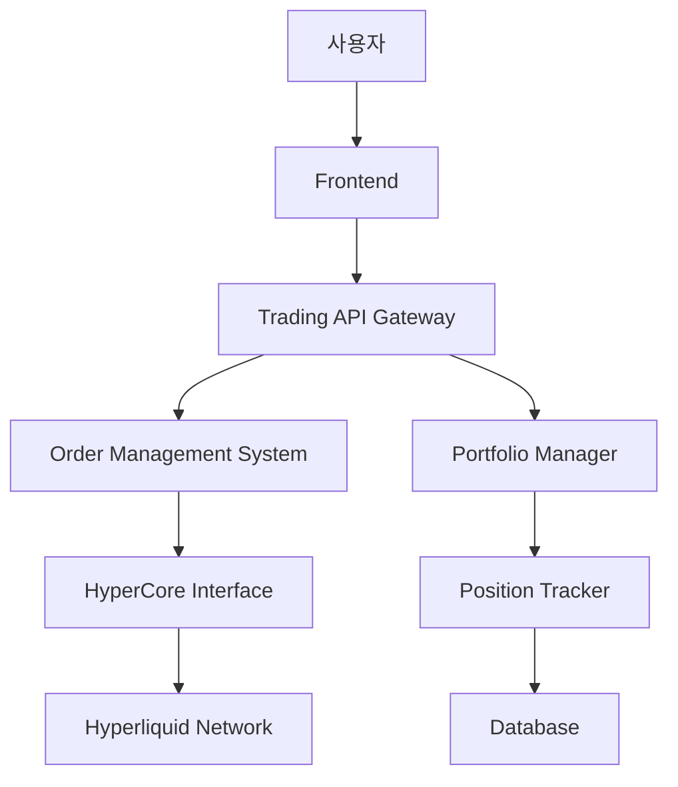

# 🎯 Cryptoindex 현물 거래 시스템 개발 계획

**개발자**: 최현수  
**브랜치**: `back_dev3`  
**기간**: 2025.07.22 ~ 2025.07.26  
**목표**: Hyperliquid 네이티브 현물 거래 시스템 구축

---

## 📅 일별 계획 Overview

| 날짜 | 목표 | 주요 작업 | 산출물 |
|------|------|-----------|--------|
| **0722** | 구조 설계 & v1 모델링 | 아키텍처 설계, API 명세 | 설계 문서, 기본 구조 |
| **0723** | v2 개발 | 핵심 거래 로직 구현 | 주문 시스템 프로토타입 |
| **0724** | v3 고도화 | 고급 주문 기능, 리스크 관리 | 완성된 거래 모듈 |
| **0725** | 최적화 & 테스트 | 성능 최적화, 단위 테스트 | 테스트 커버리지 80%+ |
| **0726** | E2E 통합 테스트 | 토큰 발행→거래→소각 전체 플로우 | 시나리오 테스트 완료 |

---

## 🏗️ Day 1 (2025.07.22) - 구조 설계 & v1 모델링

### ⏰ 시간 계획 (총 8시간)

#### 1단계: 환경 준비 및 분석 (2시간)

**작업 내용:**
- [ ] 기존 브랜치들 로컬 클론 및 실행
- [ ] back_dev1 브랜치 기능 분석
- [ ] main 브랜치 프론트엔드 구조 파악
- [ ] 현재 Privy 연동 상태 확인

**실행 스크립트:**
```bash
# 작업 디렉토리 생성
mkdir ~/cryptoindex-check && cd ~/cryptoindex-check

# 브랜치별 클론
git clone [repo] main && cd main && git checkout main && npm install && cd ..
git clone [repo] back_dev1 && cd back_dev1 && git checkout back_dev1 && npm install && cd ..
git clone [repo] back_dev3 && cd back_dev3 && git checkout back_dev3 && npm install && cd ..

# 동시 실행 테스트
cd main && PORT=3000 npm start &
cd ../back_dev1 && PORT=3001 npm start &
```

#### 2단계: Hyperliquid 아키텍처 연구 (1.5시간)

**연구 대상:**
- [ ] HyperEVM 스마트컨트랙트 구조
- [ ] HyperCore Precompile 인터페이스
- [ ] Hyperliquid 주문 시스템 분석
- [ ] 기존 DEX들의 현물 거래 시스템 벤치마킹

**참고 자료:**
- Hyperliquid 공식 문서
- Uniswap V3 구조
- dYdX 주문 시스템

#### 3단계: 시스템 아키텍처 설계 (2.5시간)

**설계 범위:**



**핵심 컴포넌트:**
- [ ] **Order Management System** - 주문 생성, 수정, 취소
- [ ] **Position Tracker** - 포지션 실시간 추적
- [ ] **Portfolio Manager** - 자산 관리
- [ ] **Risk Manager** - 리스크 관리
- [ ] **HyperCore Interface** - Hyperliquid 네트워크 연동

#### 4단계: API 명세서 작성 (1.5시간)

**API 엔드포인트 구조:**

```typescript
// 주문 관련 API
POST   /api/v1/orders          // 신규 주문
GET    /api/v1/orders          // 주문 목록
PUT    /api/v1/orders/:id      // 주문 수정
DELETE /api/v1/orders/:id      // 주문 취소

// 포지션 관리 API
GET    /api/v1/positions       // 보유 포지션
GET    /api/v1/portfolio       // 포트폴리오 요약
GET    /api/v1/balance         // 잔고 조회

// 시장 데이터 API
GET    /api/v1/markets         // 시장 목록
GET    /api/v1/markets/:symbol // 특정 토큰 정보
GET    /api/v1/orderbook/:symbol // 오더북
GET    /api/v1/trades/:symbol  // 거래 내역
```

#### 5단계: 데이터베이스 스키마 설계 (0.5시간)

**테이블 구조:**
- [ ] `orders` - 주문 정보
- [ ] `positions` - 포지션 정보  
- [ ] `trades` - 거래 내역
- [ ] `portfolios` - 포트폴리오 스냅샷

### 📝 Day 1 산출물

**1. 아키텍처 문서**
- 시스템 구조도
- 컴포넌트 간 상호작용
- 데이터 플로우

**2. API 명세서**
- RESTful API 정의
- 요청/응답 스키마
- 에러 코드 정의

**3. 데이터베이스 스키마**
- ERD 다이어그램
- 테이블 정의서
- 인덱스 전략

**4. 기술 스택 확정**
- Backend: Node.js + TypeScript
- Database: PostgreSQL
- ORM: Prisma
- API: Express.js
- WebSocket: Socket.io
- Blockchain: HyperEVM

---

## 🔧 주요 기술 요구사항

### Hyperliquid 통합
```solidity
// HyperCore Precompile 인터페이스
interface IHyperCore {
    function placeOrder(
        uint256 tokenIndex,
        uint256 amount,
        uint256 price,
        bool isBuy
    ) external returns (uint256 orderId);
    
    function cancelOrder(uint256 orderId) external;
    function getOrderStatus(uint256 orderId) external view returns (OrderStatus);
    function getUserPositions(address user) external view returns (Position[]);
}
```

### 실시간 데이터 처리
```typescript
// WebSocket을 통한 실시간 가격 업데이트
interface PriceUpdate {
    symbol: string;
    price: number;
    volume: number;
    timestamp: number;
    change24h: number;
}

// 주문 상태 실시간 추적
interface OrderUpdate {
    orderId: string;
    status: 'pending' | 'filled' | 'cancelled' | 'partial';
    filledAmount: number;
    remainingAmount: number;
}
```

### 리스크 관리
```typescript
interface RiskMetrics {
    totalExposure: number;      // 총 노출
    availableMargin: number;    // 사용 가능 마진
    marginRatio: number;        // 마진 비율
    liquidationPrice: number;   // 청산 가격
    unrealizedPnL: number;      // 미실현 손익
}
```

---

## ✅ Day 1 체크리스트

### 환경 준비
- [ ] 기존 브랜치들 로컬 실행 완료
- [ ] API 테스트 환경 구성
- [ ] 개발 도구 설정 (Postman, DB 클라이언트)

### 분석 완료
- [ ] back_dev1 기능 분석 완료
- [ ] 기존 지갑 연동 로직 파악
- [ ] Privy 인증 플로우 이해

### 설계 완료
- [ ] 전체 아키텍처 다이어그램 작성
- [ ] API 명세서 초안 완성
- [ ] 데이터베이스 스키마 설계
- [ ] 기술 스택 확정

### 문서화
- [ ] 아키텍처 문서 작성
- [ ] 개발 가이드라인 정리
- [ ] 다음 날 작업 계획 수립

---

## 🎯 예상 결과물

**Day 1 종료 시점:**
- ✅ 완성된 시스템 아키텍처
- ✅ 상세한 API 명세서
- ✅ 데이터베이스 설계서
- ✅ 기술 검증 결과
- ✅ v2 개발을 위한 구체적 계획

**측정 지표:**
- 아키텍처 컴포넌트 수: 6개 이상
- API 엔드포인트 수: 15개 이상
- 데이터베이스 테이블 수: 8개 이상
- 기술 문서 페이지 수: 20페이지 이상

---

## 🚨 위험 요소 및 대응

### 기술적 위험
**위험**: HyperEVM 관련 문서 부족
**대응**: Hyperliquid Discord 커뮤니티 활용, 기존 프로젝트 분석

**위험**: 기존 코드와의 통합 이슈  
**대응**: back_dev1 코드 철저 분석, 점진적 통합 접근

### 일정 위험
**위험**: 설계 단계에서 시간 초과
**대응**: 핵심 기능 우선순위 설정, MVP 접근법

### 기술 선택 위험
**위험**: 성능 요구사항 미충족
**대응**: 초기 성능 테스트, 확장성 고려한 설계

---

## 📞 협업 계획

### 커뮤니케이션
- **일일 스탠드업**: 오전 10시
- **진행상황 공유**: Slack #dev-backend 채널
- **코드 리뷰**: PR 단위로 진행

### 브랜치 전략
- `back_dev3`: 메인 개발 브랜치
- `feature/trading-system-v1`: Day 1 작업
- `feature/trading-system-v2`: Day 2 작업

### 문서 공유
- 아키텍처 문서: Notion
- API 문서: Swagger/OpenAPI
- 코드 문서: README.md

---

**다음**: [Day 2 계획 - 핵심 거래 로직 구현](./day2-plan.md)