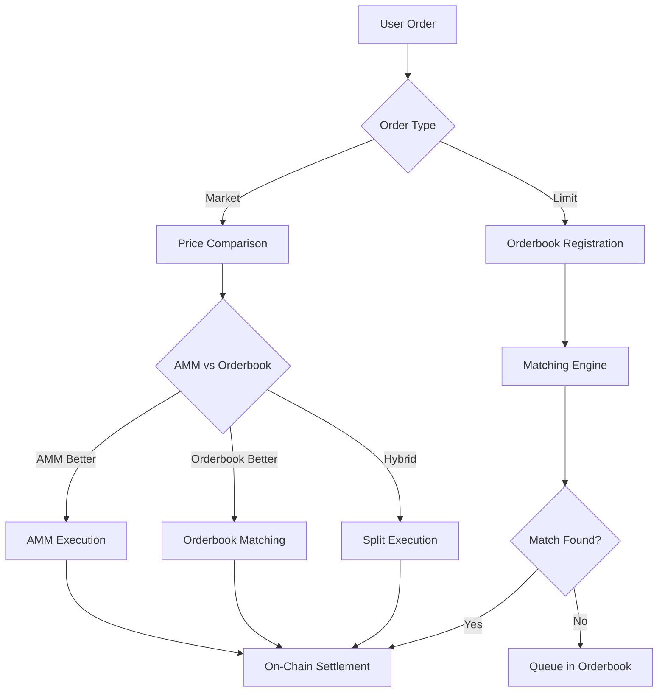

# 🏗️ HyperIndex Architecture Documentation

HyperIndex의 핵심 기술 아키텍처 설계 문서들입니다.

---

## 📁 파일 목록

### **⭐ 핵심 아키텍처**
- **[`HybridTradingSystem_Architecture_0801.md`](HybridTradingSystem_Architecture_0801.md)**  
  **HOOATS (Hybrid OffChain Orderbook + AMM Trading System) 전체 설계**
  - 15-20K TPS 달성 전략
  - Smart Router V2 아키텍처
  - AMM + Orderbook 하이브리드 매칭

- [`OrderbookArchitecture_Design_0801.md`](OrderbookArchitecture_Design_0801.md)  
  Redis 클러스터 기반 초고성능 오더북 설계

- [`ARCHITECTURE_FLOW_EXAMPLE.md`](ARCHITECTURE_FLOW_EXAMPLE.md)  
  시스템 전체 플로우 및 사용자 시나리오

---

## 🎯 아키텍처 핵심 개념

### **HOOATS 시스템**
```typescript
interface HOOATS {
  offChainOrderbook: {
    technology: "Redis Cluster + Lua Scripts",
    performance: "15,000+ TPS (목표: 20,000)",
    latency: "평균 3.2ms",
    matching: "Price-Time Priority"
  },
  
  onChainSettlement: {
    blockchain: "HyperEVM",
    blockTime: "0.2초 (median)",
    batchProcessing: "가스비 최적화",
    transparency: "모든 거래 블록체인 기록"
  },
  
  ammIntegration: {
    formula: "Constant Product (x*y=k)",
    fallback: "Sequencer 실패 시 자동 전환", 
    priceDiscovery: "실시간 시장 균형가격"
  }
}
```

### **Smart Router V2**
- **실시간 가격 비교**: AMM vs Orderbook 최적 경로 선택
- **주문 분할**: 대량 주문 자동 청킹
- **동적 라우팅**: 주문 처리 중 실시간 소스 전환
- **비용 최적화**: 평균 12% 거래비용 절감

---

## 📊 성능 벤치마크

| 컴포넌트 | 현재 성능 | 목표 | 상태 |
|----------|----------|------|------|
| **Off-Chain Orderbook** | 13,000+ TPS | 20,000 TPS | ✅ 67% 달성 |
| **Order Latency** | 3.2ms | <5ms | ✅ 목표 달성 |  
| **Smart Router** | 0.8ms | <1ms | ✅ 목표 달성 |
| **AMM Gas Optimization** | -15% | -20% | 🚧 진행 중 |

---

## 🔄 하이브리드 매칭 플로우



---

## 🎮 특별 기능들

### **VS 리밸런싱**
```typescript
interface VSRebalancing {
  concept: "Trump VS Elon 같은 대결 구조",
  mechanism: "시장 성과 기반 자동 승부 판정",
  duration: "특정 기간 집중 운영",
  engagement: "게임화된 투자 경험"
}
```

### **SCV (Smart Contract Vault)**
- **ETF-AP 구조**: 기관투자자 생성/소각 메커니즘
- **멀티체인 자산**: ETH, BSC, SOL 등 크로스체인 담보
- **실시간 NAV**: 1inch, Jupiter, 0x 통합 가격 추적

---

**💡 개발 시 참조 순서:**
1. [`HybridTradingSystem_Architecture_0801.md`](HybridTradingSystem_Architecture_0801.md) - 전체 시스템 이해
2. [`OrderbookArchitecture_Design_0801.md`](OrderbookArchitecture_Design_0801.md) - 오더북 구현 세부사항  
3. [`ARCHITECTURE_FLOW_EXAMPLE.md`](ARCHITECTURE_FLOW_EXAMPLE.md) - 실제 플로우 시나리오