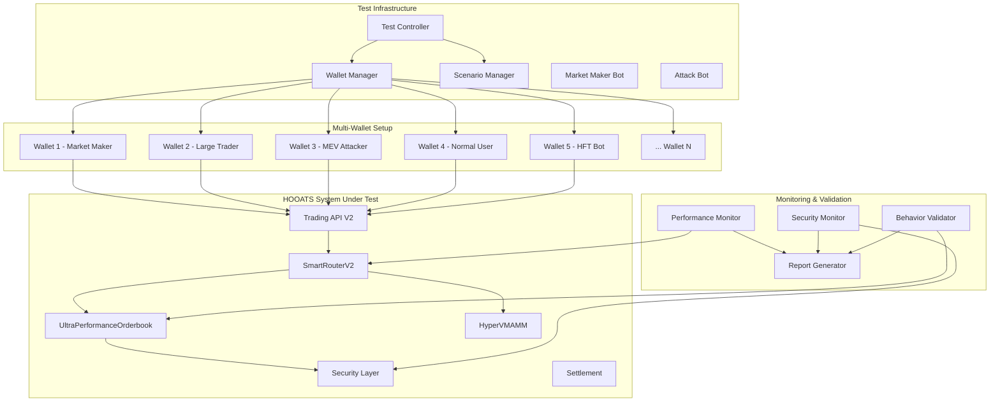

# HOOATS Comprehensive Test Scenarios
*Created: 2025-08-13*

## Executive Summary

This document outlines a comprehensive testing framework for the HOOATS (Hybrid OffChain Orderbook + AMM Trading System) designed to simulate real-world trading conditions with multiple participants, security attacks, and high-throughput scenarios. The testing infrastructure leverages multiple wallets and simulates realistic market conditions to validate system performance, security, and reliability.

## Testing Architecture Overview



## Test Infrastructure Design

### 1. Multi-Wallet Architecture

#### Wallet Categories & Roles
- **Market Makers (8-10 wallets)**
  - Provide continuous liquidity on both sides
  - Place large limit orders with tight spreads
  - Simulate institutional trading patterns
  - Test orderbook depth maintenance

- **Large Traders (5-8 wallets)**
  - Execute substantial market orders (10K+ USDC)
  - Trigger AMM/Orderbook routing decisions
  - Test chunking and price impact algorithms
  - Validate routing efficiency

- **MEV Attackers (5-8 wallets)**
  - Attempt sandwich attacks
  - Front-running strategies
  - Price manipulation attempts
  - Coordinated attack patterns
  - Test security layer effectiveness

- **Normal Users (15-25 wallets)**
  - Small to medium trades (10-1000 USDC)
  - Mixed order types (market/limit)
  - Realistic trading intervals
  - Representative retail behavior

- **High-Frequency Traders (5-10 wallets)**
  - Legitimate high-speed trading patterns
  - Latency optimization testing
  - Rate limiting stress testing
  - Distinguished from MEV attackers

- **Stress Test Bots (Variable)**
  - Generate high-volume order flow
  - Test TPS limits (15-20K target)
  - Concurrent order execution
  - System breaking point identification

**Total Test Wallets: 50-60 wallets**

### 2. Test Environment Setup

#### Infrastructure Requirements
```
Redis Cluster:
- 3 Redis nodes for high availability
- Memory: 8GB per node
- Replication factor: 2

PostgreSQL:
- Primary + Read replica
- Connection pool: 100 connections
- Performance monitoring enabled

HyperEVM Testnet:
- 50+ funded test wallets
- HYPERINDEX/USDC test tokens
- Deployed AMM contracts with liquidity

Load Testing Tools:
- Artillery.js for HTTP load testing
- Custom WebSocket stress testing
- Real-time metrics collection
```

#### Wallet Preparation Strategy
```
Wallet Funding Matrix:
- Market Makers (10 wallets): 100,000 HYPERINDEX + 100,000 USDC each
- Large Traders (8 wallets): 500,000 USDC each  
- MEV Attackers (8 wallets): 50,000 USDC each (high gas allocation)
- Normal Users (25 wallets): 1,000-10,000 USDC each
- High-Frequency Traders (10 wallets): 100,000 USDC each
- Stress Bots (Variable): 10,000 USDC each

Total Test Capital: ~8M USDC equivalent
Total Test Wallets: 60+ wallets for comprehensive testing
```

## Core Test Scenarios

### Scenario 1: Hybrid Routing Under Load

#### Objective
Validate SmartRouterV2's ability to optimally route large orders between AMM and Orderbook under concurrent trading pressure.

#### Setup
```
Market Makers: 8 wallets placing 200 limit orders (buy/sell sides)
Large Traders: 3 wallets executing 50K USDC market orders
Background Noise: 15 normal users trading randomly
Duration: 30 minutes continuous trading
```

#### Test Flow
1. **Phase 1 (0-5 min): Market Setup**
   - Market makers establish orderbook depth
   - AMM pools initialized with substantial liquidity
   - Baseline spread: 0.1-0.2%

2. **Phase 2 (5-15 min): Normal Trading**
   - Normal users execute small orders
   - System learns price patterns
   - Routing preferences stabilize

3. **Phase 3 (15-25 min): Large Order Stress**
   - Large traders execute sequential market orders
   - Test chunking algorithm effectiveness
   - Monitor AMM price impact vs orderbook efficiency

4. **Phase 4 (25-30 min): Concurrent Pressure**
   - All participants trade simultaneously
   - Maximum routing complexity
   - System stability under peak load

#### Success Criteria
- **Routing Efficiency**: 95%+ orders achieve better than market price
- **Latency**: P99 < 100ms for routing decisions
- **Chunking Accuracy**: Price impact < 2% for large orders
- **System Stability**: 0 routing failures under load

### Scenario 2: MEV Attack Prevention

#### Objective
Validate security layer's ability to detect and prevent various MEV attack patterns while maintaining legitimate trading functionality.

#### Attack Vectors Tested

##### 2.1 Sandwich Attack Simulation
```
Attacker Wallet Setup:
- 3 coordinated wallets
- High gas allocation for front-running
- Automated attack pattern execution

Attack Pattern:
1. Monitor pending large market orders
2. Place buy order just before victim order
3. Place sell order immediately after victim fills
4. Attempt to capture spread difference
```

##### 2.2 High-Frequency MEV Spam
```
Attack Pattern:
- 100+ orders per second from single wallet
- Rapid order placement/cancellation
- Attempt to overwhelm rate limiting
- Test nonce manipulation
```

##### 2.3 Price Manipulation Attempt
```
Attack Pattern:
- Coordinated buy/sell walls
- Artificial price movement creation
- Large order splitting to avoid detection
- Cross-market manipulation attempts
```

#### Defense Validation Framework
1. **Commit-Reveal Testing**
   - Verify orders go through proper commitment phase
   - Test reveal timing requirements
   - Validate cryptographic commitments

2. **Batch Auction Integrity**
   - Confirm fair ordering within batches
   - Test uniform price calculation
   - Validate MEV-resistant execution

3. **Statistical Detection**
   - Monitor attack pattern recognition
   - Test false positive rates on legitimate trading
   - Validate behavior analysis accuracy

#### Success Criteria
- **Attack Detection Rate**: 99%+ of known MEV patterns blocked
- **False Positive Rate**: <1% of legitimate orders flagged
- **Response Time**: MEV detection within 100ms
- **System Resilience**: Continued operation under attack

### Scenario 3: Settlement System Integrity

#### Objective
Validate on-chain settlement system's ability to batch process orderbook trades while maintaining atomicity and gas efficiency.

#### Test Architecture
```
Settlement Queue Simulation:
- 100 concurrent orderbook trades
- Mixed order sizes (10-10,000 USDC)
- Different trading pairs
- Varied settlement priorities

Batch Processing Test:
- Target batch size: 10 trades
- Expected batches: 10 transactions
- Gas efficiency target: 90% reduction vs individual settlements
```

#### Settlement Flow Testing
1. **Queue Management**
   - Orders accumulate in settlement queue
   - Priority ordering validation
   - Batch formation logic testing

2. **On-chain Execution**
   - Batch transaction construction
   - Smart contract interaction testing
   - Gas estimation accuracy

3. **State Synchronization**
   - PostgreSQL updates on settlement success
   - Redis hot data consistency
   - User balance reconciliation

4. **Failure Recovery**
   - Settlement transaction failures
   - Partial batch execution scenarios
   - Retry mechanism validation

#### Success Criteria
- **Settlement Success Rate**: 99.9%+
- **Gas Efficiency**: 90%+ reduction through batching
- **State Consistency**: 100% database/blockchain sync
- **Recovery Time**: <30 seconds for failed settlements

### Scenario 4: High-Throughput Performance

#### Objective
Validate system's ability to achieve target 15-20K TPS while maintaining order integrity and security.

#### Load Testing Configuration
```
Traffic Generation:
- 50 concurrent trading bots
- 400 orders per second per bot
- Mixed order types and sizes
- Sustained load for 60 minutes

Performance Targets:
- Target TPS: 15,000-20,000
- Latency P99: <50ms
- Error Rate: <0.1%
- Memory Usage: Stable (no leaks)
```

#### TPS Scaling Test Phases

##### Phase 1: Baseline (1K TPS)
- 5 trading bots active
- Establish performance baseline
- System warmup and optimization

##### Phase 2: Moderate Load (5K TPS)
- 15 trading bots active
- Monitor resource utilization
- Identify bottlenecks early

##### Phase 3: High Load (15K TPS)
- 40 trading bots active
- Target performance zone
- Full system stress testing

##### Phase 4: Maximum Load (20K+ TPS)
- 50+ trading bots active
- Beyond target performance
- System breaking point identification

#### Performance Monitoring Stack
```
Real-time Metrics:
- Redis operations per second
- PostgreSQL connection utilization
- Memory pool efficiency (GC pressure)
- CPU utilization per core (parallel processing)
- Network I/O throughput

Business Metrics:
- Order processing latency
- Trade execution success rate
- Routing decision accuracy
- Settlement queue depth
```

### Scenario 5: Routing Efficiency Validation

#### Objective
Validate that SmartRouterV2 consistently chooses the optimal execution path (AMM vs Orderbook) and that no artificial arbitrage opportunities exist within the system.

#### Test Framework
```
Routing Decision Validation:
1. Price comparison: AMM spot price vs Orderbook best bid/ask
2. Slippage analysis: Actual vs expected price impact  
3. Execution efficiency: Best available price achievement rate
4. Chunking optimization: Large order splitting effectiveness
5. Zero internal arbitrage: No profitable cross-venue opportunities
```

#### Cross-System State Validation
Ensure data consistency between Redis hot storage, PostgreSQL cold storage, and on-chain settlement states.

```
State Synchronization Points:
1. Order placement: Redis → PostgreSQL
2. Order matching: Redis → Redis + PostgreSQL
3. Trade execution: Redis → Settlement Queue
4. Settlement completion: On-chain → PostgreSQL
5. Balance updates: All systems synchronized
```

#### Consistency Testing Methodology
1. **Eventual Consistency Validation**
   - Allow normal operation for 30 minutes
   - Compare states across all systems
   - Identify and investigate discrepancies

2. **Failure Injection Testing**
   - Simulate Redis failures
   - Test PostgreSQL connection drops
   - Validate recovery procedures

3. **Race Condition Testing**
   - Concurrent order modifications
   - Simultaneous settlement processing
   - Cross-system update conflicts

#### Success Criteria
- **Routing Efficiency**: 99%+ orders achieve optimal price
- **Internal Arbitrage**: 0 profitable arbitrage opportunities detected
- **State Consistency**: 99.99%+ across all systems
- **Recovery Time**: <60 seconds for system failures
- **Data Loss**: 0 confirmed trades lost
- **Reconciliation**: Automatic conflict resolution

## Advanced Security Testing

### Penetration Testing Scenarios

#### 1. Authentication Bypass Attempts
- JWT token manipulation
- Privy integration vulnerabilities
- Session hijacking attempts
- Development token abuse

#### 2. Rate Limiting Evasion
- IP rotation strategies
- Distributed attack simulation
- Header manipulation techniques
- Token bucket algorithm testing

#### 3. Input Validation Testing
- SQL injection attempts on order parameters
- Order parameter manipulation
- Malformed JSON payload testing
- Unicode and encoding attacks

#### 4. Business Logic Attacks
- Balance manipulation attempts
- Order replay attacks
- Price oracle manipulation simulation
- Smart contract interaction exploits

### Security Monitoring Validation

#### Real-time Alert Testing
```
Alert Scenarios:
- Suspicious order patterns detected
- Multiple failed authentication attempts
- Unusual trading velocity from single user
- Settlement transaction failures
- System resource exhaustion
```

#### Audit Trail Verification
- Complete order lifecycle tracking
- Security event correlation
- Compliance reporting accuracy
- Forensic data integrity

## Performance Benchmarking Framework

### Key Performance Indicators (KPIs)

#### Trading Performance
- **Order Throughput**: Orders processed per second
- **Trade Execution Latency**: Time from order to fill confirmation
- **Routing Efficiency**: Percentage of orders getting best available price
- **Slippage Control**: Average price impact vs expected

#### System Performance
- **API Response Time**: P50, P95, P99 latencies
- **Database Performance**: Query execution times
- **Memory Efficiency**: GC pressure and memory pool utilization
- **CPU Utilization**: Multi-core efficiency metrics

#### Security Performance
- **Attack Detection Speed**: Time to identify MEV patterns
- **False Positive Rate**: Legitimate orders incorrectly flagged
- **Security Processing Overhead**: Additional latency from security layers
- **Audit Log Performance**: Logging throughput and storage efficiency

### Continuous Performance Monitoring

#### Real-time Dashboards
```
Dashboard Categories:
1. Trading Metrics Dashboard
   - Live TPS counter
   - Order success/failure rates
   - Average routing times
   - Price impact metrics

2. System Health Dashboard
   - Redis cluster status
   - PostgreSQL performance
   - Memory usage patterns
   - API endpoint health

3. Security Dashboard
   - Attack attempts blocked
   - Suspicious activity alerts
   - Rate limiting statistics
   - Audit log throughput

4. Settlement Dashboard
   - Pending settlement queue
   - Batch processing efficiency
   - On-chain transaction status
   - Gas usage optimization
```

## Test Execution Framework

### Automated Test Orchestration

#### Test Suite Structure
```
Test Execution Phases:
1. Environment Setup (5 minutes)
   - Deploy contracts to testnet
   - Initialize wallet funding
   - Configure system parameters
   - Validate infrastructure health

2. Baseline Establishment (10 minutes)
   - Single-user functionality testing
   - Basic routing validation
   - Security system verification
   - Performance baseline measurement

3. Multi-User Scenario Execution (Variable)
   - Execute test scenarios sequentially
   - Parallel scenario execution for stress testing
   - Real-time monitoring and alerting
   - Automatic failure recovery

4. Results Collection & Analysis (5 minutes)
   - Aggregate performance metrics
   - Security event analysis
   - Financial reconciliation
   - Report generation
```

#### Test Data Management

##### Pre-Test Setup
- Automated wallet funding from faucet
- Test token distribution
- AMM liquidity provisioning
- Orderbook initialization

##### Post-Test Cleanup
- Test data archival
- Performance metrics storage
- Security audit log retention
- Financial reconciliation reports

### Continuous Integration Integration

#### Automated Testing Pipeline
```
CI/CD Integration:
1. Code Push Trigger
   - Automated test environment deployment
   - Infrastructure health checks
   - Test suite execution
   - Results validation

2. Scheduled Testing
   - Nightly full test suite execution
   - Weekly security penetration testing
   - Monthly performance benchmarking
   - Quarterly disaster recovery testing

3. Performance Regression Detection
   - Baseline performance tracking
   - Automated threshold alerts
   - Performance trend analysis
   - Optimization recommendations
```

## Risk Management & Contingency Planning

### Test Environment Isolation
- Completely isolated from production systems
- Separate database instances
- Independent Redis clusters
- Dedicated HyperEVM testnet deployment

### Emergency Response Procedures
- Automated test termination triggers
- Rapid environment reset capabilities
- Security incident response protocols
- Performance degradation handling

### Financial Risk Controls
- Maximum test capital limits
- Automated balance monitoring
- Suspicious activity detection
- Emergency fund recovery procedures

## Success Metrics & Reporting

### Test Completion Criteria

#### Functional Testing
- ✅ All core trading flows functional
- ✅ Security systems operational
- ✅ Settlement system reliable
- ✅ Cross-system consistency maintained

#### Performance Testing
- ✅ Target TPS achieved (15-20K)
- ✅ Latency requirements met (P99 < 100ms)
- ✅ System stability under load
- ✅ Memory efficiency validated

#### Security Testing
- ✅ MEV attacks successfully blocked
- ✅ Rate limiting effective
- ✅ Audit trails complete
- ✅ Authentication system secure

### Comprehensive Test Report Structure

#### Executive Summary
- Overall test success rate
- Key performance achievements
- Critical issues identified
- Readiness assessment for production

#### Detailed Results
- Scenario-by-scenario analysis
- Performance benchmarks vs targets
- Security vulnerability assessment
- System reliability metrics

#### Recommendations
- Production deployment readiness
- Performance optimization opportunities
- Security hardening suggestions
- Monitoring and alerting improvements

## Conclusion

This comprehensive testing framework ensures the HOOATS system is thoroughly validated across all dimensions: functionality, performance, security, and reliability. The multi-wallet approach simulates realistic market conditions while the systematic scenario execution provides confidence in production readiness.

The testing infrastructure is designed to be:
- **Scalable**: Support varying load levels and user counts
- **Realistic**: Simulate actual trading conditions and attack patterns
- **Comprehensive**: Cover all system components and integration points
- **Automated**: Enable continuous testing and regression detection
- **Measurable**: Provide clear success criteria and detailed reporting

Upon successful completion of all test scenarios, the HOOATS system will be validated as production-ready for testnet deployment with high confidence in its ability to handle real-world trading volumes, security threats, and operational requirements.