# 🏗️ HyperIndex 아키텍처 다이어그램

> **Last Updated**: 2025-10-04  
> **이 문서는 Mermaid 다이어그램을 사용합니다**  
> GitHub, VS Code, Notion 등에서 바로 렌더링됩니다.

---

## 📋 목차

1. [전체 시스템 아키텍처](#전체-시스템-아키텍처)
2. [컴포넌트 다이어그램](#컴포넌트-다이어그램)
3. [데이터 흐름도](#데이터-흐름도)
4. [시퀀스 다이어그램](#시퀀스-다이어그램)
5. [네트워크 아키텍처](#네트워크-아키텍처)
6. [배포 아키텍처](#배포-아키텍처)
7. [데이터베이스 스키마](#데이터베이스-스키마)

---

## 전체 시스템 아키텍처

### 고수준 아키텍처

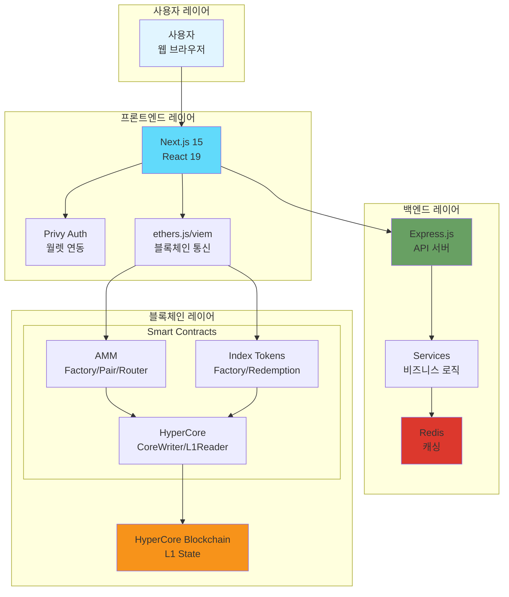
```mermaid
graph TB
    subgraph "사용자 레이어"
        User[사용자<br/>웹 브라우저]
    end

    subgraph "프론트엔드 레이어"
        NextJS[Next.js 15<br/>React 19]
        Privy[Privy Auth<br/>월렛 연동]
        Ethers[ethers.js/viem<br/>블록체인 통신]
    end

    subgraph "백엔드 레이어"
        Express[Express.js<br/>API 서버]
        Services[Services<br/>비즈니스 로직]
        Cache[Redis<br/>캐싱]
    end

    subgraph "블록체인 레이어"
        subgraph "Smart Contracts"
            AMM[AMM<br/>Factory/Pair/Router]
            IndexToken[Index Tokens<br/>Factory/Redemption]
            HyperCore[HyperCore<br/>CoreWriter/L1Reader]
        end
        Blockchain[HyperCore Blockchain<br/>L1 State]
    end

    User --> NextJS
    NextJS --> Privy
    NextJS --> Ethers
    NextJS --> Express
    Express --> Services
    Services --> Cache
    Ethers --> AMM
    Ethers --> IndexToken
    AMM --> HyperCore
    IndexToken --> HyperCore
    HyperCore --> Blockchain

    style User fill:#e1f5ff
    style NextJS fill:#61dafb
    style Express fill:#68a063
    style Cache fill:#dc382d
    style Blockchain fill:#f7931a
```

---

### 상세 시스템 구조

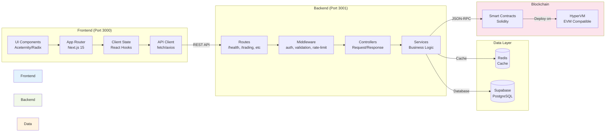
```mermaid
graph LR
    subgraph "Frontend (Port 3000)"
        direction TB
        UI[UI Components<br/>Aceternity/Radix]
        AppRouter[App Router<br/>Next.js 15]
        ClientState[Client State<br/>React Hooks]
        API_Client[API Client<br/>fetch/axios]
        
        UI --> AppRouter
        AppRouter --> ClientState
        ClientState --> API_Client
    end

    subgraph "Backend (Port 3001)"
        direction TB
        Routes[Routes<br/>/health, /trading, etc]
        Middleware[Middleware<br/>auth, validation, rate-limit]
        Controllers[Controllers<br/>Request/Response]
        ServiceLayer[Services<br/>Business Logic]
        
        Routes --> Middleware
        Middleware --> Controllers
        Controllers --> ServiceLayer
    end

    subgraph "Data Layer"
        direction TB
        RedisCache[(Redis<br/>Cache)]
        Supabase[(Supabase<br/>PostgreSQL)]
    end

    subgraph "Blockchain"
        direction TB
        Contracts[Smart Contracts<br/>Solidity]
        HyperVM[HyperVM<br/>EVM Compatible]
    end

    API_Client -->|REST API| Routes
    ServiceLayer -->|Cache| RedisCache
    ServiceLayer -->|Database| Supabase
    ServiceLayer -->|JSON-RPC| Contracts
    Contracts -->|Deploy on| HyperVM

    style Frontend fill:#e3f2fd
    style Backend fill:#f1f8e9
    style Data fill:#fff3e0
    style Blockchain fill:#fce4ec
```

---

## 컴포넌트 다이어그램

### Frontend 컴포넌트

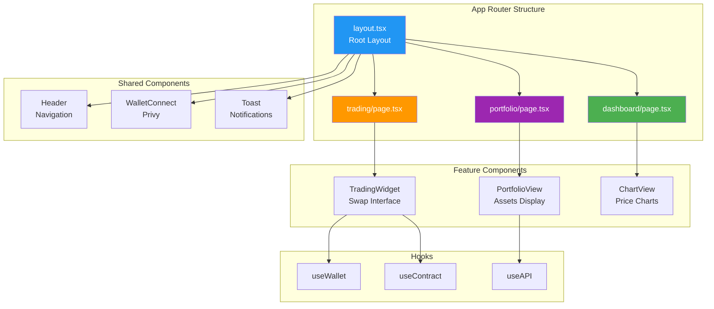
```mermaid
graph TB
    subgraph "App Router Structure"
        Layout[layout.tsx<br/>Root Layout]
        Dashboard[dashboard/page.tsx]
        Trading[trading/page.tsx]
        Portfolio[portfolio/page.tsx]
        
        Layout --> Dashboard
        Layout --> Trading
        Layout --> Portfolio
    end

    subgraph "Shared Components"
        Header[Header<br/>Navigation]
        Wallet[WalletConnect<br/>Privy]
        Toast[Toast<br/>Notifications]
        
        Layout --> Header
        Layout --> Wallet
        Layout --> Toast
    end

    subgraph "Feature Components"
        TradingWidget[TradingWidget<br/>Swap Interface]
        PortfolioView[PortfolioView<br/>Assets Display]
        ChartView[ChartView<br/>Price Charts]
        
        Trading --> TradingWidget
        Portfolio --> PortfolioView
        Dashboard --> ChartView
    end

    subgraph "Hooks"
        useWallet[useWallet]
        useContract[useContract]
        useAPI[useAPI]
        
        TradingWidget --> useWallet
        TradingWidget --> useContract
        PortfolioView --> useAPI
    end

    style Layout fill:#2196f3,color:#fff
    style Dashboard fill:#4caf50,color:#fff
    style Trading fill:#ff9800,color:#fff
    style Portfolio fill:#9c27b0,color:#fff
```

---

### Backend 컴포넌트

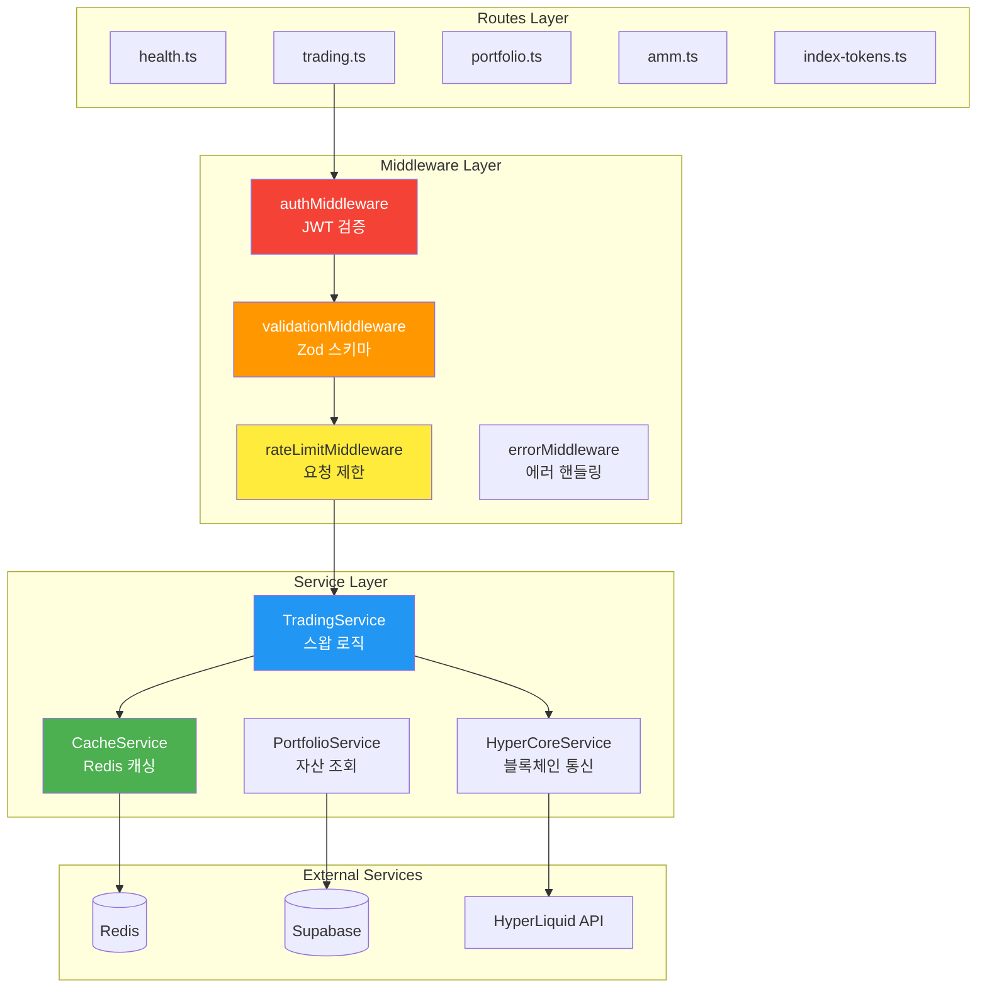
```mermaid
graph TB
    subgraph "Routes Layer"
        HealthRoute[health.ts]
        TradingRoute[trading.ts]
        PortfolioRoute[portfolio.ts]
        AMMRoute[amm.ts]
        IndexRoute[index-tokens.ts]
    end

    subgraph "Middleware Layer"
        AuthMW[authMiddleware<br/>JWT 검증]
        ValidateMW[validationMiddleware<br/>Zod 스키마]
        RateLimitMW[rateLimitMiddleware<br/>요청 제한]
        ErrorMW[errorMiddleware<br/>에러 핸들링]
    end

    subgraph "Service Layer"
        CacheService[CacheService<br/>Redis 캐싱]
        TradingService[TradingService<br/>스왑 로직]
        PortfolioService[PortfolioService<br/>자산 조회]
        HyperCoreService[HyperCoreService<br/>블록체인 통신]
    end

    subgraph "External Services"
        Redis[(Redis)]
        Supabase[(Supabase)]
        HyperLiquid[HyperLiquid API]
    end

    TradingRoute --> AuthMW
    AuthMW --> ValidateMW
    ValidateMW --> RateLimitMW
    RateLimitMW --> TradingService
    
    TradingService --> CacheService
    TradingService --> HyperCoreService
    
    CacheService --> Redis
    PortfolioService --> Supabase
    HyperCoreService --> HyperLiquid

    style AuthMW fill:#f44336,color:#fff
    style ValidateMW fill:#ff9800,color:#fff
    style RateLimitMW fill:#ffeb3b
    style CacheService fill:#4caf50,color:#fff
    style TradingService fill:#2196f3,color:#fff
```

---

## 데이터 흐름도

### 토큰 스왑 플로우

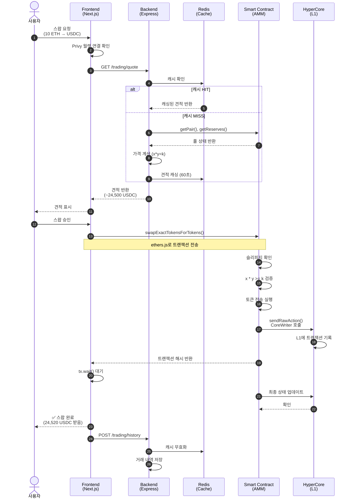
```mermaid
sequenceDiagram
    autonumber
    actor User as 사용자
    participant Frontend as Frontend<br/>(Next.js)
    participant Backend as Backend<br/>(Express)
    participant Redis as Redis<br/>(Cache)
    participant Contract as Smart Contract<br/>(AMM)
    participant HyperCore as HyperCore<br/>(L1)

    User->>Frontend: 스왑 요청<br/>(10 ETH → USDC)
    
    Frontend->>Frontend: Privy 월렛 연결 확인
    
    Frontend->>Backend: GET /trading/quote
    Backend->>Redis: 캐시 확인
    
    alt 캐시 HIT
        Redis-->>Backend: 캐싱된 견적 반환
    else 캐시 MISS
        Backend->>Contract: getPair(), getReserves()
        Contract-->>Backend: 풀 상태 반환
        Backend->>Backend: 가격 계산 (x*y=k)
        Backend->>Redis: 견적 캐싱 (60초)
    end
    
    Backend-->>Frontend: 견적 반환<br/>(~24,500 USDC)
    Frontend-->>User: 견적 표시

    User->>Frontend: 스왑 승인

    Frontend->>Contract: swapExactTokensForTokens()
    Note over Frontend,Contract: ethers.js로 트랜잭션 전송

    Contract->>Contract: 슬리피지 확인
    Contract->>Contract: x * y >= k 검증
    Contract->>Contract: 토큰 전송 실행
    
    Contract->>HyperCore: sendRawAction()<br/>CoreWriter 호출
    HyperCore->>HyperCore: L1에 트랜잭션 기록

    Contract-->>Frontend: 트랜잭션 해시 반환
    Frontend->>Frontend: tx.wait() 대기

    Contract->>HyperCore: 최종 상태 업데이트
    HyperCore-->>Contract: 확인

    Frontend-->>User: ✅ 스왑 완료<br/>(24,520 USDC 받음)

    Frontend->>Backend: POST /trading/history
    Backend->>Redis: 캐시 무효화
    Backend->>Backend: 거래 내역 저장
```

---

### 인덱스 토큰 발행 플로우

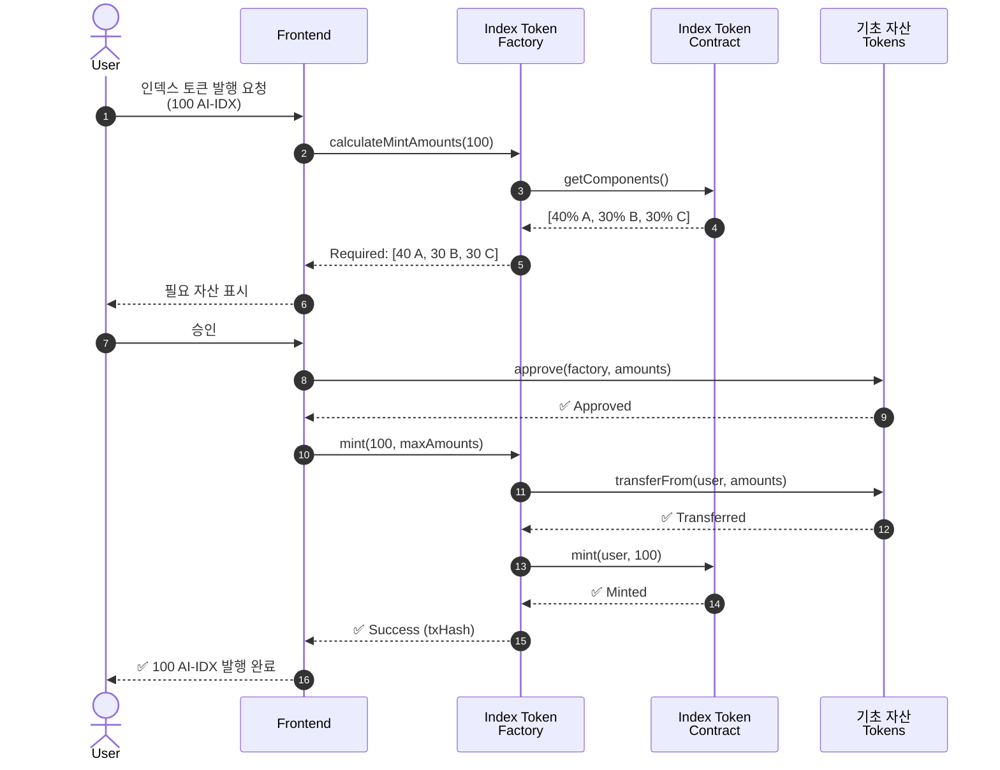
```mermaid
sequenceDiagram
    autonumber
    actor User
    participant Frontend
    participant IndexFactory as Index Token<br/>Factory
    participant IndexToken as Index Token<br/>Contract
    participant UnderlyingTokens as 기초 자산<br/>Tokens

    User->>Frontend: 인덱스 토큰 발행 요청<br/>(100 AI-IDX)
    
    Frontend->>IndexFactory: calculateMintAmounts(100)
    IndexFactory->>IndexToken: getComponents()
    IndexToken-->>IndexFactory: [40% A, 30% B, 30% C]
    IndexFactory-->>Frontend: Required: [40 A, 30 B, 30 C]
    
    Frontend-->>User: 필요 자산 표시
    User->>Frontend: 승인

    Frontend->>UnderlyingTokens: approve(factory, amounts)
    UnderlyingTokens-->>Frontend: ✅ Approved

    Frontend->>IndexFactory: mint(100, maxAmounts)
    
    IndexFactory->>UnderlyingTokens: transferFrom(user, amounts)
    UnderlyingTokens-->>IndexFactory: ✅ Transferred
    
    IndexFactory->>IndexToken: mint(user, 100)
    IndexToken-->>IndexFactory: ✅ Minted
    
    IndexFactory-->>Frontend: ✅ Success (txHash)
    Frontend-->>User: ✅ 100 AI-IDX 발행 완료
```

---

### 캐싱 전략 플로우

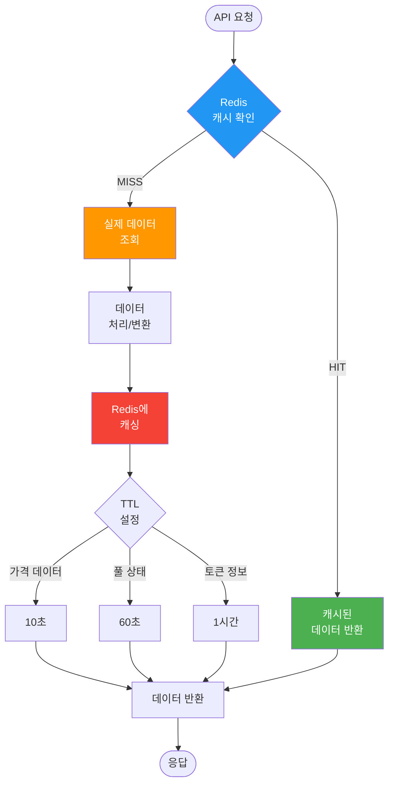
```mermaid
flowchart TD
    Start([API 요청]) --> CheckCache{Redis<br/>캐시 확인}
    
    CheckCache -->|HIT| ReturnCache[캐시된<br/>데이터 반환]
    CheckCache -->|MISS| FetchData[실제 데이터<br/>조회]
    
    FetchData --> ProcessData[데이터<br/>처리/변환]
    ProcessData --> SaveCache[Redis에<br/>캐싱]
    SaveCache --> CheckTTL{TTL<br/>설정}
    
    CheckTTL -->|가격 데이터| Set10s[10초]
    CheckTTL -->|풀 상태| Set60s[60초]
    CheckTTL -->|토큰 정보| Set1h[1시간]
    
    Set10s --> ReturnData
    Set60s --> ReturnData
    Set1h --> ReturnData
    ReturnCache --> ReturnData[데이터 반환]
    
    ReturnData --> End([응답])

    style CheckCache fill:#2196f3,color:#fff
    style ReturnCache fill:#4caf50,color:#fff
    style FetchData fill:#ff9800,color:#fff
    style SaveCache fill:#f44336,color:#fff
```

---

## 시퀀스 다이어그램

### 사용자 인증 플로우

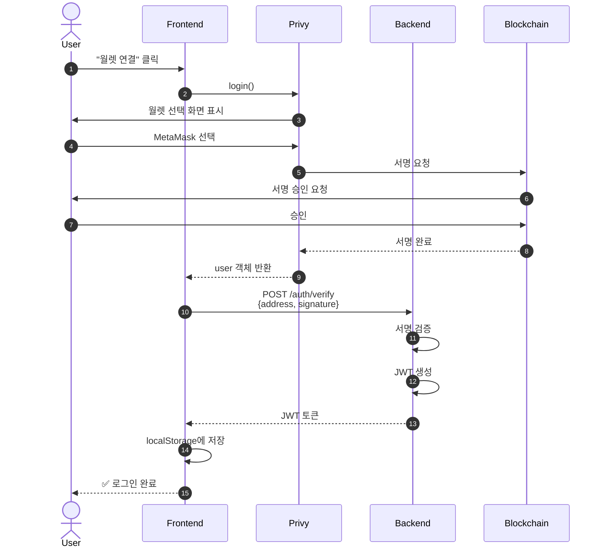
```mermaid
sequenceDiagram
    autonumber
    actor User
    participant Frontend
    participant Privy
    participant Backend
    participant Blockchain

    User->>Frontend: "월렛 연결" 클릭
    Frontend->>Privy: login()
    
    Privy->>User: 월렛 선택 화면 표시
    User->>Privy: MetaMask 선택
    
    Privy->>Blockchain: 서명 요청
    Blockchain->>User: 서명 승인 요청
    User->>Blockchain: 승인
    
    Blockchain-->>Privy: 서명 완료
    Privy-->>Frontend: user 객체 반환
    
    Frontend->>Backend: POST /auth/verify<br/>{address, signature}
    Backend->>Backend: 서명 검증
    Backend->>Backend: JWT 생성
    Backend-->>Frontend: JWT 토큰
    
    Frontend->>Frontend: localStorage에 저장
    Frontend-->>User: ✅ 로그인 완료
```

---

### 유동성 풀 생성 플로우

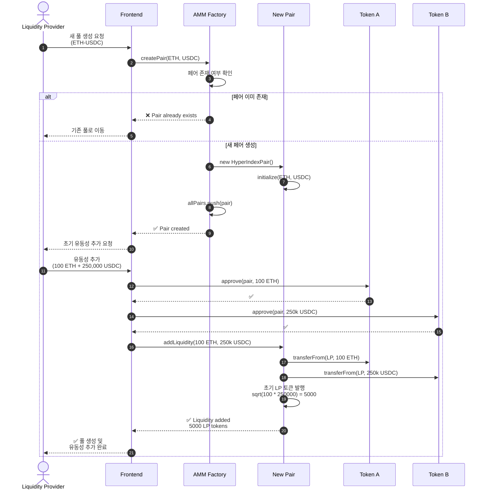
```mermaid
sequenceDiagram
    autonumber
    actor LP as Liquidity Provider
    participant Frontend
    participant Factory as AMM Factory
    participant Pair as New Pair
    participant TokenA as Token A
    participant TokenB as Token B

    LP->>Frontend: 새 풀 생성 요청<br/>(ETH-USDC)
    
    Frontend->>Factory: createPair(ETH, USDC)
    Factory->>Factory: 페어 존재 여부 확인
    
    alt 페어 이미 존재
        Factory-->>Frontend: ❌ Pair already exists
        Frontend-->>LP: 기존 풀로 이동
    else 새 페어 생성
        Factory->>Pair: new HyperIndexPair()
        Pair->>Pair: initialize(ETH, USDC)
        Factory->>Factory: allPairs.push(pair)
        Factory-->>Frontend: ✅ Pair created
        
        Frontend-->>LP: 초기 유동성 추가 요청
        
        LP->>Frontend: 유동성 추가<br/>(100 ETH + 250,000 USDC)
        
        Frontend->>TokenA: approve(pair, 100 ETH)
        TokenA-->>Frontend: ✅
        Frontend->>TokenB: approve(pair, 250k USDC)
        TokenB-->>Frontend: ✅
        
        Frontend->>Pair: addLiquidity(100 ETH, 250k USDC)
        
        Pair->>TokenA: transferFrom(LP, 100 ETH)
        Pair->>TokenB: transferFrom(LP, 250k USDC)
        
        Pair->>Pair: 초기 LP 토큰 발행<br/>sqrt(100 * 250000) = 5000
        
        Pair-->>Frontend: ✅ Liquidity added<br/>5000 LP tokens
        
        Frontend-->>LP: ✅ 풀 생성 및<br/>유동성 추가 완료
    end
```

---

## 네트워크 아키텍처

### Docker 네트워크 구조

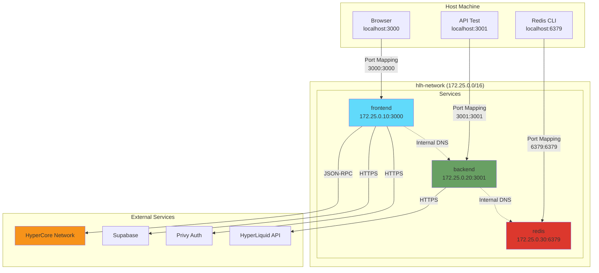
```mermaid
graph TB
    subgraph "hlh-network (172.25.0.0/16)"
        subgraph "Services"
            Frontend[frontend<br/>172.25.0.10:3000]
            Backend[backend<br/>172.25.0.20:3001]
            Redis[redis<br/>172.25.0.30:6379]
        end
        
        Frontend -.->|Internal DNS| Backend
        Backend -.->|Internal DNS| Redis
    end

    subgraph "Host Machine"
        Browser[Browser<br/>localhost:3000]
        API_Test[API Test<br/>localhost:3001]
        Redis_CLI[Redis CLI<br/>localhost:6379]
    end

    subgraph "External Services"
        Privy_Service[Privy Auth]
        Supabase_Service[Supabase]
        HyperLiquid_Service[HyperLiquid API]
        Blockchain_Net[HyperCore Network]
    end

    Browser -->|Port Mapping<br/>3000:3000| Frontend
    API_Test -->|Port Mapping<br/>3001:3001| Backend
    Redis_CLI -->|Port Mapping<br/>6379:6379| Redis

    Frontend -->|HTTPS| Privy_Service
    Frontend -->|HTTPS| Supabase_Service
    Backend -->|HTTPS| HyperLiquid_Service
    Frontend -->|JSON-RPC| Blockchain_Net

    style Frontend fill:#61dafb
    style Backend fill:#68a063
    style Redis fill:#dc382d
    style Blockchain_Net fill:#f7931a
```

---

### 프로덕션 네트워크 구조

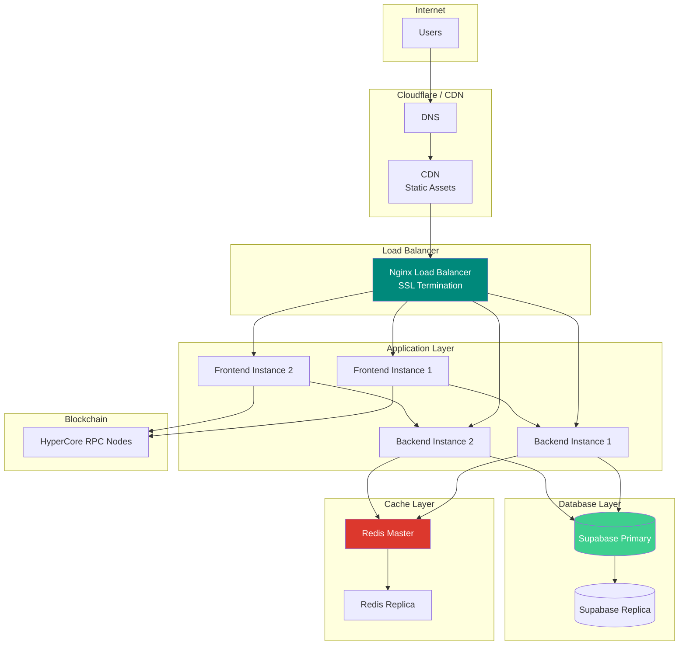
```mermaid
graph TB
    subgraph "Internet"
        Users[Users]
    end

    subgraph "Cloudflare / CDN"
        CDN[CDN<br/>Static Assets]
        DNS[DNS]
    end

    subgraph "Load Balancer"
        LB[Nginx Load Balancer<br/>SSL Termination]
    end

    subgraph "Application Layer"
        Frontend1[Frontend Instance 1]
        Frontend2[Frontend Instance 2]
        Backend1[Backend Instance 1]
        Backend2[Backend Instance 2]
    end

    subgraph "Cache Layer"
        Redis_Master[Redis Master]
        Redis_Replica[Redis Replica]
    end

    subgraph "Database Layer"
        Supabase_Primary[(Supabase Primary)]
        Supabase_Replica[(Supabase Replica)]
    end

    subgraph "Blockchain"
        HyperCore_RPC[HyperCore RPC Nodes]
    end

    Users --> DNS
    DNS --> CDN
    CDN --> LB
    
    LB --> Frontend1
    LB --> Frontend2
    LB --> Backend1
    LB --> Backend2

    Frontend1 --> Backend1
    Frontend2 --> Backend2
    
    Backend1 --> Redis_Master
    Backend2 --> Redis_Master
    Redis_Master --> Redis_Replica
    
    Backend1 --> Supabase_Primary
    Backend2 --> Supabase_Primary
    Supabase_Primary --> Supabase_Replica

    Frontend1 --> HyperCore_RPC
    Frontend2 --> HyperCore_RPC

    style LB fill:#00897b,color:#fff
    style Redis_Master fill:#dc382d,color:#fff
    style Supabase_Primary fill:#3ecf8e,color:#fff
```

---

## 배포 아키텍처

### 개발 환경 (Docker Compose)

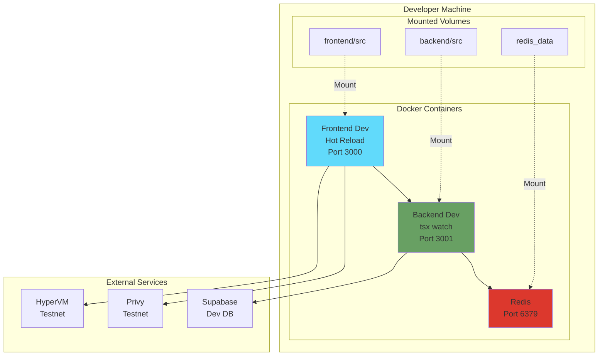
```mermaid
graph TB
    subgraph "Developer Machine"
        subgraph "Docker Containers"
            FE_Dev[Frontend Dev<br/>Hot Reload<br/>Port 3000]
            BE_Dev[Backend Dev<br/>tsx watch<br/>Port 3001]
            Redis_Dev[Redis<br/>Port 6379]
        end
        
        subgraph "Mounted Volumes"
            FE_Code[frontend/src]
            BE_Code[backend/src]
            Redis_Data[redis_data]
        end
        
        FE_Code -.->|Mount| FE_Dev
        BE_Code -.->|Mount| BE_Dev
        Redis_Data -.->|Mount| Redis_Dev
    end

    subgraph "External Services"
        Privy_Dev[Privy<br/>Testnet]
        Supabase_Dev[Supabase<br/>Dev DB]
        HyperVM_Test[HyperVM<br/>Testnet]
    end

    FE_Dev --> BE_Dev
    BE_Dev --> Redis_Dev
    FE_Dev --> Privy_Dev
    BE_Dev --> Supabase_Dev
    FE_Dev --> HyperVM_Test

    style FE_Dev fill:#61dafb
    style BE_Dev fill:#68a063
    style Redis_Dev fill:#dc382d
```

---

### 프로덕션 배포 (AWS ECS / Kubernetes)

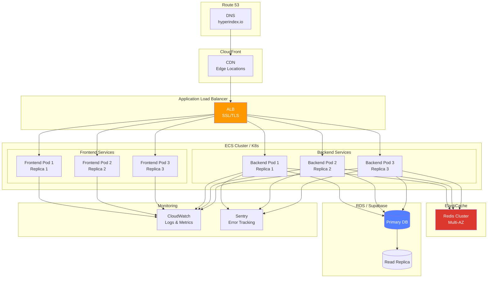
```mermaid
graph TB
    subgraph "Route 53"
        DNS[DNS<br/>hyperindex.io]
    end

    subgraph "CloudFront"
        CF[CDN<br/>Edge Locations]
    end

    subgraph "Application Load Balancer"
        ALB[ALB<br/>SSL/TLS]
    end

    subgraph "ECS Cluster / K8s"
        subgraph "Frontend Services"
            FE1[Frontend Pod 1<br/>Replica 1]
            FE2[Frontend Pod 2<br/>Replica 2]
            FE3[Frontend Pod 3<br/>Replica 3]
        end
        
        subgraph "Backend Services"
            BE1[Backend Pod 1<br/>Replica 1]
            BE2[Backend Pod 2<br/>Replica 2]
            BE3[Backend Pod 3<br/>Replica 3]
        end
    end

    subgraph "ElastiCache"
        Redis_Cluster[Redis Cluster<br/>Multi-AZ]
    end

    subgraph "RDS / Supabase"
        DB_Primary[(Primary DB)]
        DB_Replica[(Read Replica)]
    end

    subgraph "Monitoring"
        CloudWatch[CloudWatch<br/>Logs & Metrics]
        Sentry[Sentry<br/>Error Tracking]
    end

    DNS --> CF
    CF --> ALB
    ALB --> FE1 & FE2 & FE3
    ALB --> BE1 & BE2 & BE3
    
    BE1 & BE2 & BE3 --> Redis_Cluster
    BE1 & BE2 & BE3 --> DB_Primary
    DB_Primary --> DB_Replica
    
    FE1 & FE2 & FE3 --> CloudWatch
    BE1 & BE2 & BE3 --> CloudWatch
    BE1 & BE2 & BE3 --> Sentry

    style ALB fill:#ff9900,color:#fff
    style Redis_Cluster fill:#dc382d,color:#fff
    style DB_Primary fill:#527fff,color:#fff
```

---

## 데이터베이스 스키마

### Supabase 테이블 구조 (예상)

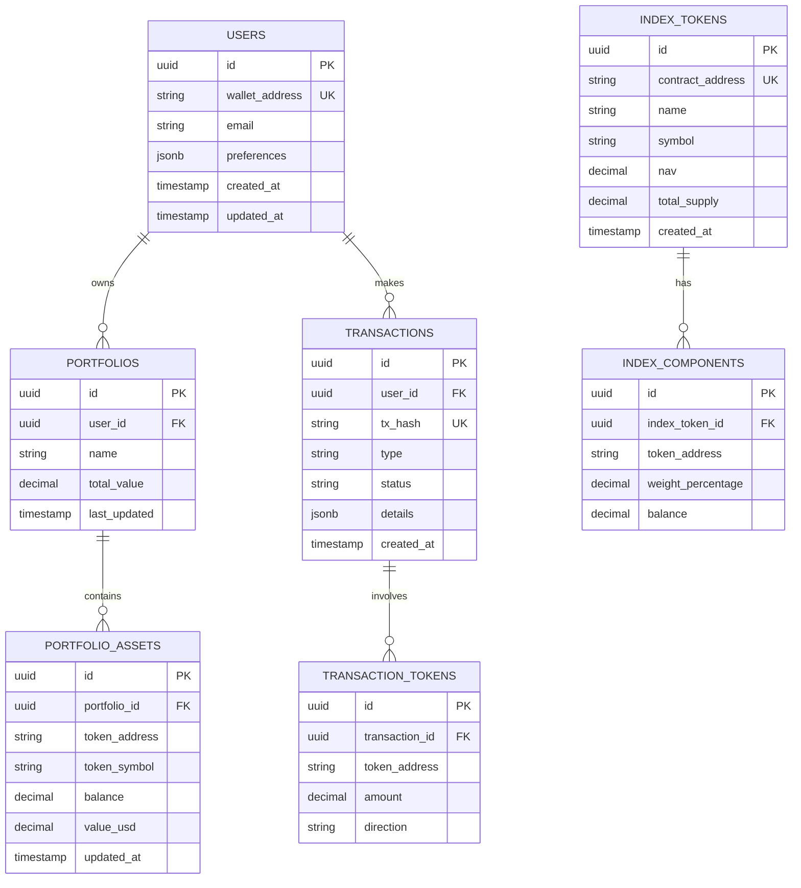
```mermaid
erDiagram
    USERS ||--o{ PORTFOLIOS : owns
    USERS ||--o{ TRANSACTIONS : makes
    PORTFOLIOS ||--o{ PORTFOLIO_ASSETS : contains
    TRANSACTIONS ||--o{ TRANSACTION_TOKENS : involves
    INDEX_TOKENS ||--o{ INDEX_COMPONENTS : has
    
    USERS {
        uuid id PK
        string wallet_address UK
        string email
        jsonb preferences
        timestamp created_at
        timestamp updated_at
    }
    
    PORTFOLIOS {
        uuid id PK
        uuid user_id FK
        string name
        decimal total_value
        timestamp last_updated
    }
    
    PORTFOLIO_ASSETS {
        uuid id PK
        uuid portfolio_id FK
        string token_address
        string token_symbol
        decimal balance
        decimal value_usd
        timestamp updated_at
    }
    
    TRANSACTIONS {
        uuid id PK
        uuid user_id FK
        string tx_hash UK
        string type
        string status
        jsonb details
        timestamp created_at
    }
    
    TRANSACTION_TOKENS {
        uuid id PK
        uuid transaction_id FK
        string token_address
        decimal amount
        string direction
    }
    
    INDEX_TOKENS {
        uuid id PK
        string contract_address UK
        string name
        string symbol
        decimal nav
        decimal total_supply
        timestamp created_at
    }
    
    INDEX_COMPONENTS {
        uuid id PK
        uuid index_token_id FK
        string token_address
        decimal weight_percentage
        decimal balance
    }
```

---

### Redis 키 구조

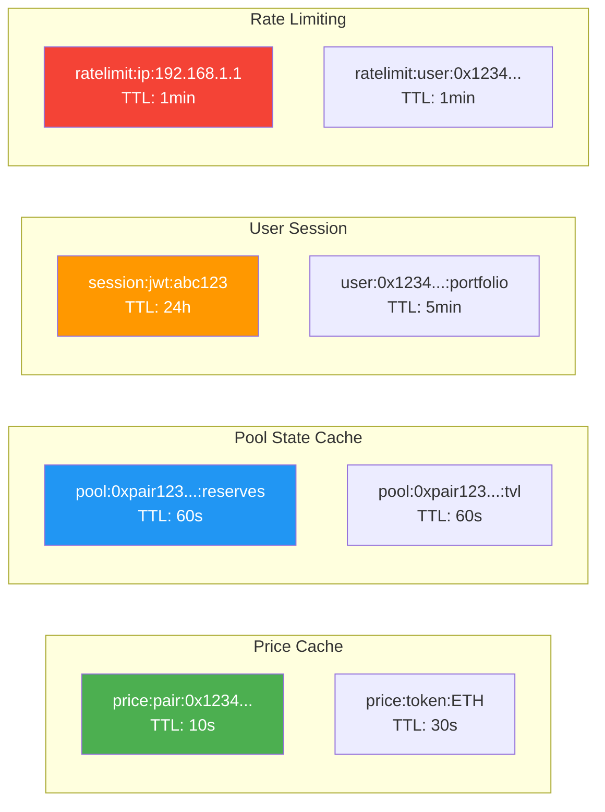
```mermaid
graph LR
    subgraph "Price Cache"
        P1["price:pair:0x1234...<br/>TTL: 10s"]
        P2["price:token:ETH<br/>TTL: 30s"]
    end
    
    subgraph "Pool State Cache"
        PS1["pool:0xpair123...:reserves<br/>TTL: 60s"]
        PS2["pool:0xpair123...:tvl<br/>TTL: 60s"]
    end
    
    subgraph "User Session"
        S1["session:jwt:abc123<br/>TTL: 24h"]
        S2["user:0x1234...:portfolio<br/>TTL: 5min"]
    end
    
    subgraph "Rate Limiting"
        RL1["ratelimit:ip:192.168.1.1<br/>TTL: 1min"]
        RL2["ratelimit:user:0x1234...<br/>TTL: 1min"]
    end

    style P1 fill:#4caf50,color:#fff
    style PS1 fill:#2196f3,color:#fff
    style S1 fill:#ff9800,color:#fff
    style RL1 fill:#f44336,color:#fff
```

---

## Smart Contract 아키텍처

### Contract 상속 구조

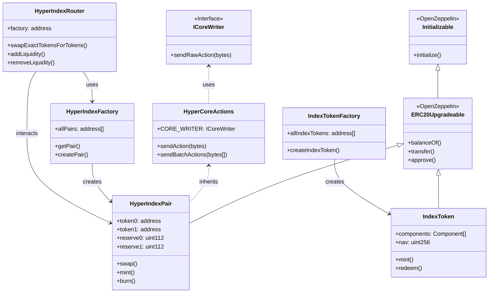
```mermaid
classDiagram
    class Initializable {
        <<OpenZeppelin>>
        +initialize()
    }
    
    class ERC20Upgradeable {
        <<OpenZeppelin>>
        +balanceOf()
        +transfer()
        +approve()
    }
    
    class ICoreWriter {
        <<Interface>>
        +sendRawAction(bytes)
    }
    
    class HyperCoreActions {
        +CORE_WRITER: ICoreWriter
        +sendAction(bytes)
        +sendBatchActions(bytes[])
    }
    
    class HyperIndexPair {
        +token0: address
        +token1: address
        +reserve0: uint112
        +reserve1: uint112
        +swap()
        +mint()
        +burn()
    }
    
    class HyperIndexFactory {
        +allPairs: address[]
        +getPair()
        +createPair()
    }
    
    class HyperIndexRouter {
        +factory: address
        +swapExactTokensForTokens()
        +addLiquidity()
        +removeLiquidity()
    }
    
    class IndexToken {
        +components: Component[]
        +nav: uint256
        +mint()
        +redeem()
    }
    
    class IndexTokenFactory {
        +allIndexTokens: address[]
        +createIndexToken()
    }
    
    Initializable <|-- ERC20Upgradeable
    ERC20Upgradeable <|-- HyperIndexPair
    ERC20Upgradeable <|-- IndexToken
    
    ICoreWriter <.. HyperCoreActions: uses
    HyperCoreActions <.. HyperIndexPair: inherits
    
    HyperIndexFactory --> HyperIndexPair: creates
    HyperIndexRouter --> HyperIndexFactory: uses
    HyperIndexRouter --> HyperIndexPair: interacts
    
    IndexTokenFactory --> IndexToken: creates
```

---

## 보안 아키텍처

### 보안 계층

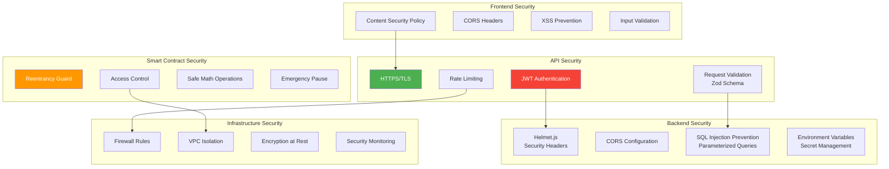
```mermaid
graph TB
    subgraph "Frontend Security"
        CSP[Content Security Policy]
        CORS_F[CORS Headers]
        XSS[XSS Prevention]
        Input_Validation[Input Validation]
    end

    subgraph "API Security"
        HTTPS[HTTPS/TLS]
        JWT_Auth[JWT Authentication]
        Rate_Limit[Rate Limiting]
        Request_Validation[Request Validation<br/>Zod Schema]
    end

    subgraph "Backend Security"
        Helmet[Helmet.js<br/>Security Headers]
        CORS_B[CORS Configuration]
        SQL_Injection[SQL Injection Prevention<br/>Parameterized Queries]
        Secrets[Environment Variables<br/>Secret Management]
    end

    subgraph "Smart Contract Security"
        ReentrancyGuard[Reentrancy Guard]
        AccessControl[Access Control]
        SafeMath[Safe Math Operations]
        Pausable[Emergency Pause]
    end

    subgraph "Infrastructure Security"
        Firewall[Firewall Rules]
        VPC[VPC Isolation]
        Encryption[Encryption at Rest]
        Monitoring[Security Monitoring]
    end

    CSP --> HTTPS
    JWT_Auth --> Helmet
    Rate_Limit --> Firewall
    Request_Validation --> SQL_Injection
    AccessControl --> VPC
    
    style JWT_Auth fill:#f44336,color:#fff
    style HTTPS fill:#4caf50,color:#fff
    style ReentrancyGuard fill:#ff9800,color:#fff
```

---

## CI/CD 파이프라인

```mermaid
graph LR
    subgraph "Development"
        Dev[Developer<br/>git push]
    end

    subgraph "GitHub Actions"
        Checkout[Checkout Code]
        Lint[ESLint &<br/>Prettier]
        Test[Unit Tests<br/>Jest]
        Build[Docker Build]
        Security[Security Scan<br/>Snyk]
    end

    subgraph "Container Registry"
        ECR[AWS ECR /<br/>Docker Hub]
    end

    subgraph "Deployment"
        Dev_Deploy[Dev Environment<br/>Auto Deploy]
        Staging_Deploy[Staging<br/>Manual Approval]
        Prod_Deploy[Production<br/>Manual Approval]
    end

    subgraph "Monitoring"
        Monitor[CloudWatch /<br/>Sentry]
    end

    Dev --> Checkout
    Checkout --> Lint
    Lint --> Test
    Test --> Build
    Build --> Security
    Security --> ECR
    
    ECR --> Dev_Deploy
    Dev_Deploy --> Staging_Deploy
    Staging_Deploy --> Prod_Deploy
    
    Prod_Deploy --> Monitor

    style Test fill:#4caf50,color:#fff
    style Security fill:#f44336,color:#fff
    style Prod_Deploy fill:#ff9800,color:#fff
```

---

## 모니터링 아키텍처

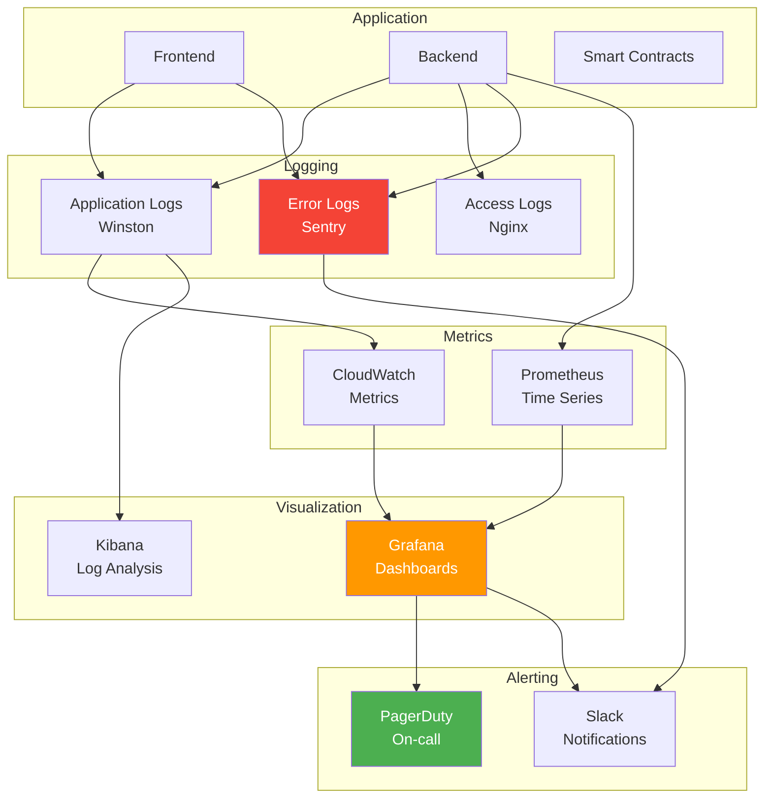
```mermaid
graph TB
    subgraph "Application"
        Frontend[Frontend]
        Backend[Backend]
        Contracts[Smart Contracts]
    end

    subgraph "Logging"
        AppLogs[Application Logs<br/>Winston]
        AccessLogs[Access Logs<br/>Nginx]
        ErrorLogs[Error Logs<br/>Sentry]
    end

    subgraph "Metrics"
        CloudWatch[CloudWatch<br/>Metrics]
        Prometheus[Prometheus<br/>Time Series]
    end

    subgraph "Visualization"
        Grafana[Grafana<br/>Dashboards]
        Kibana[Kibana<br/>Log Analysis]
    end

    subgraph "Alerting"
        PagerDuty[PagerDuty<br/>On-call]
        Slack[Slack<br/>Notifications]
    end

    Frontend --> AppLogs
    Backend --> AppLogs
    Backend --> AccessLogs
    Frontend --> ErrorLogs
    Backend --> ErrorLogs

    AppLogs --> CloudWatch
    Backend --> Prometheus
    
    CloudWatch --> Grafana
    Prometheus --> Grafana
    AppLogs --> Kibana
    
    Grafana --> PagerDuty
    Grafana --> Slack
    ErrorLogs --> Slack

    style ErrorLogs fill:#f44336,color:#fff
    style Grafana fill:#ff9800,color:#fff
    style PagerDuty fill:#4caf50,color:#fff
```

---

## 스케일링 전략

### 수평적 확장

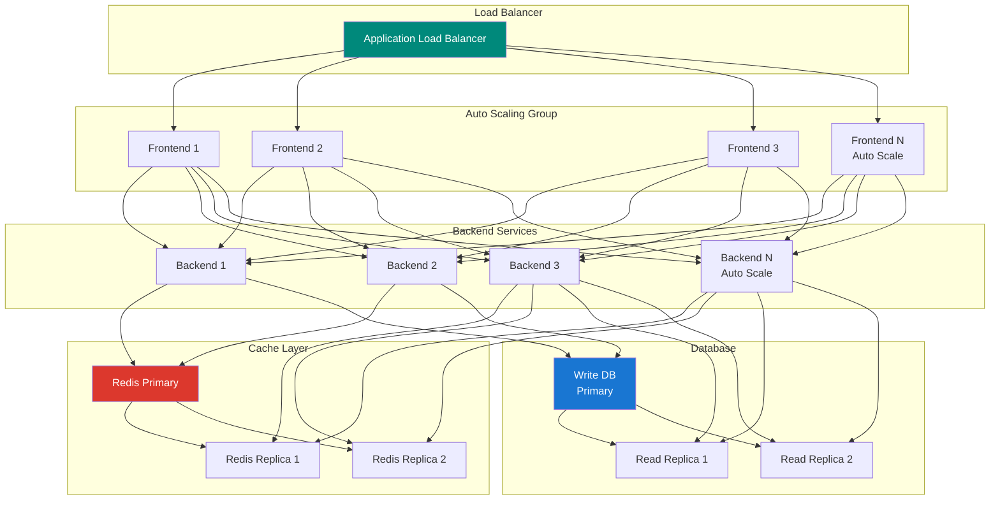
```mermaid
graph TB
    subgraph "Load Balancer"
        LB[Application Load Balancer]
    end

    subgraph "Auto Scaling Group"
        FE1[Frontend 1]
        FE2[Frontend 2]
        FE3[Frontend 3]
        FE_N[Frontend N<br/>Auto Scale]
    end

    subgraph "Backend Services"
        BE1[Backend 1]
        BE2[Backend 2]
        BE3[Backend 3]
        BE_N[Backend N<br/>Auto Scale]
    end

    subgraph "Cache Layer"
        Redis_Primary[Redis Primary]
        Redis_R1[Redis Replica 1]
        Redis_R2[Redis Replica 2]
    end

    subgraph "Database"
        DB_Write[Write DB<br/>Primary]
        DB_Read1[Read Replica 1]
        DB_Read2[Read Replica 2]
    end

    LB --> FE1 & FE2 & FE3 & FE_N
    FE1 & FE2 & FE3 & FE_N --> BE1 & BE2 & BE3 & BE_N
    
    BE1 & BE2 --> Redis_Primary
    BE3 & BE_N --> Redis_R1 & Redis_R2
    
    BE1 & BE2 --> DB_Write
    BE3 & BE_N --> DB_Read1 & DB_Read2
    
    Redis_Primary --> Redis_R1 & Redis_R2
    DB_Write --> DB_Read1 & DB_Read2

    style LB fill:#00897b,color:#fff
    style Redis_Primary fill:#dc382d,color:#fff
    style DB_Write fill:#1976d2,color:#fff
```

---

## 다이어그램 렌더링 가이드

### GitHub에서 보기
1. 이 파일을 GitHub에 푸시
2. `.md` 파일을 클릭하면 자동으로 렌더링됨

### VS Code에서 보기
1. Markdown Preview Mermaid Support 확장 설치
2. `Cmd+Shift+V` (macOS) 또는 `Ctrl+Shift+V` (Windows/Linux)

### Notion에서 보기
1. 이 파일을 Notion으로 임포트
2. Mermaid 블록이 자동으로 다이어그램으로 렌더링됨

### 온라인 에디터
- [Mermaid Live Editor](https://mermaid.live/)
- 코드 복사/붙여넣기로 실시간 편집 가능

---

## 추가 리소스

### 아키텍처 관련 문서
- [시스템 설계 문서](./SYSTEM_DESIGN.md) (향후 작성)
- [배포 가이드](./DEPLOYMENT_GUIDE.md) (향후 작성)
- [보안 체크리스트](./SECURITY_CHECKLIST.md) (향후 작성)

### Mermaid 문법 참고
- [Mermaid 공식 문서](https://mermaid.js.org/)
- [Mermaid 치트시트](https://jojozhuang.github.io/tutorial/mermaid-cheat-sheet/)

---

**Last Updated**: 2025-10-04  
**Maintained by**: HyperIndex Development Team
