# 🏗️ HyperIndex 아키텍처 다이어그램

> **Last Updated**: 2025-10-04  
> **이 문서는 Mermaid 다이어그램을 사용합니다**  
> GitHub, VS Code, Notion 등에서 바로 렌더링됩니다.

---

## 📋 목차

1. [전체 시스템 아키텍처](#전체-시스템-아키텍처)
2. [컴포넌트 다이어그램](#컴포넌트-다이어그램)
3. [데이터 흐름도](#데이터-흐름도)
4. [시퀀스 다이어그램](#시퀀스-다이어그램)
5. [네트워크 아키텍처](#네트워크-아키텍처)
6. [배포 아키텍처](#배포-아키텍처)
7. [데이터베이스 스키마](#데이터베이스-스키마)

---

## 전체 시스템 아키텍처

### 고수준 아키텍처

```mermaid
graph TB
    subgraph "사용자 레이어"
        User[사용자<br/>웹 브라우저]
    end

    subgraph "프론트엔드 레이어"
        NextJS[Next.js 15<br/>React 19]
        Privy[Privy Auth<br/>월렛 연동]
        Ethers[ethers.js/viem<br/>블록체인 통신]
    end

    subgraph "백엔드 레이어"
        Express[Express.js<br/>API 서버]
        Services[Services<br/>비즈니스 로직]
        Cache[Redis<br/>캐싱]
    end

    subgraph "블록체인 레이어"
        subgraph "Smart Contracts"
            AMM[AMM<br/>Factory/Pair/Router]
            IndexToken[Index Tokens<br/>Factory/Redemption]
            HyperCore[HyperCore<br/>CoreWriter/L1Reader]
        end
        Blockchain[HyperCore Blockchain<br/>L1 State]
    end

    User --> NextJS
    NextJS --> Privy
    NextJS --> Ethers
    NextJS --> Express
    Express --> Services
    Services --> Cache
    Ethers --> AMM
    Ethers --> IndexToken
    AMM --> HyperCore
    IndexToken --> HyperCore
    HyperCore --> Blockchain

    style User fill:#e1f5ff
    style NextJS fill:#61dafb
    style Express fill:#68a063
    style Cache fill:#dc382d
    style Blockchain fill:#f7931a
```

---

### 상세 시스템 구조

---

## 컴포넌트 다이어그램

### Frontend 컴포넌트

---

### Backend 컴포넌트

```mermaid
graph TB
    subgraph "Routes Layer"
        HealthRoute[health.ts]
        TradingRoute[trading.ts]
        PortfolioRoute[portfolio.ts]
        AMMRoute[amm.ts]
        IndexRoute[index-tokens.ts]
    end

    subgraph "Middleware Layer"
        AuthMW[authMiddleware<br/>JWT 검증]
        ValidateMW[validationMiddleware<br/>Zod 스키마]
        RateLimitMW[rateLimitMiddleware<br/>요청 제한]
        ErrorMW[errorMiddleware<br/>에러 핸들링]
    end

    subgraph "Service Layer"
        CacheService[CacheService<br/>Redis 캐싱]
        TradingService[TradingService<br/>스왑 로직]
        PortfolioService[PortfolioService<br/>자산 조회]
        HyperCoreService[HyperCoreService<br/>블록체인 통신]
    end

    subgraph "External Services"
        Redis[(Redis)]
        Supabase[(Supabase)]
        HyperLiquid[HyperLiquid API]
    end

    TradingRoute --> AuthMW
    AuthMW --> ValidateMW
    ValidateMW --> RateLimitMW
    RateLimitMW --> TradingService
    
    TradingService --> CacheService
    TradingService --> HyperCoreService
    
    CacheService --> Redis
    PortfolioService --> Supabase
    HyperCoreService --> HyperLiquid

    style AuthMW fill:#f44336,color:#fff
    style ValidateMW fill:#ff9800,color:#fff
    style RateLimitMW fill:#ffeb3b
    style CacheService fill:#4caf50,color:#fff
    style TradingService fill:#2196f3,color:#fff
```

---

## 데이터 흐름도

### 토큰 스왑 플로우

```mermaid
sequenceDiagram
    autonumber
    actor User as 사용자
    participant Frontend as Frontend<br/>(Next.js)
    participant Backend as Backend<br/>(Express)
    participant Redis as Redis<br/>(Cache)
    participant Contract as Smart Contract<br/>(AMM)
    participant HyperCore as HyperCore<br/>(L1)

    User->>Frontend: 스왑 요청<br/>(10 ETH → USDC)
    
    Frontend->>Frontend: Privy 월렛 연결 확인
    
    Frontend->>Backend: GET /trading/quote
    Backend->>Redis: 캐시 확인
    
    alt 캐시 HIT
        Redis-->>Backend: 캐싱된 견적 반환
    else 캐시 MISS
        Backend->>Contract: getPair(), getReserves()
        Contract-->>Backend: 풀 상태 반환
        Backend->>Backend: 가격 계산 (x*y=k)
        Backend->>Redis: 견적 캐싱 (60초)
    end
    
    Backend-->>Frontend: 견적 반환<br/>(~24,500 USDC)
    Frontend-->>User: 견적 표시

    User->>Frontend: 스왑 승인

    Frontend->>Contract: swapExactTokensForTokens()
    Note over Frontend,Contract: ethers.js로 트랜잭션 전송

    Contract->>Contract: 슬리피지 확인
    Contract->>Contract: x * y >= k 검증
    Contract->>Contract: 토큰 전송 실행
    
    Contract->>HyperCore: sendRawAction()<br/>CoreWriter 호출
    HyperCore->>HyperCore: L1에 트랜잭션 기록

    Contract-->>Frontend: 트랜잭션 해시 반환
    Frontend->>Frontend: tx.wait() 대기

    Contract->>HyperCore: 최종 상태 업데이트
    HyperCore-->>Contract: 확인

    Frontend-->>User: ✅ 스왑 완료<br/>(24,520 USDC 받음)

    Frontend->>Backend: POST /trading/history
    Backend->>Redis: 캐시 무효화
    Backend->>Backend: 거래 내역 저장
```

---

### 인덱스 토큰 발행 플로우

```mermaid
sequenceDiagram
    autonumber
    actor User
    participant Frontend
    participant IndexFactory as Index Token<br/>Factory
    participant IndexToken as Index Token<br/>Contract
    participant UnderlyingTokens as 기초 자산<br/>Tokens

    User->>Frontend: 인덱스 토큰 발행 요청<br/>(100 AI-IDX)
    
    Frontend->>IndexFactory: calculateMintAmounts(100)
    IndexFactory->>IndexToken: getComponents()
    IndexToken-->>IndexFactory: [40% A, 30% B, 30% C]
    IndexFactory-->>Frontend: Required: [40 A, 30 B, 30 C]
    
    Frontend-->>User: 필요 자산 표시
    User->>Frontend: 승인

    Frontend->>UnderlyingTokens: approve(factory, amounts)
    UnderlyingTokens-->>Frontend: ✅ Approved

    Frontend->>IndexFactory: mint(100, maxAmounts)
    
    IndexFactory->>UnderlyingTokens: transferFrom(user, amounts)
    UnderlyingTokens-->>IndexFactory: ✅ Transferred
    
    IndexFactory->>IndexToken: mint(user, 100)
    IndexToken-->>IndexFactory: ✅ Minted
    
    IndexFactory-->>Frontend: ✅ Success (txHash)
    Frontend-->>User: ✅ 100 AI-IDX 발행 완료
```

---

### 캐싱 전략 플로우

```mermaid
flowchart TD
    Start([API 요청]) --> CheckCache{Redis<br/>캐시 확인}
    
    CheckCache -->|HIT| ReturnCache[캐시된<br/>데이터 반환]
    CheckCache -->|MISS| FetchData[실제 데이터<br/>조회]
    
    FetchData --> ProcessData[데이터<br/>처리/변환]
    ProcessData --> SaveCache[Redis에<br/>캐싱]
    SaveCache --> CheckTTL{TTL<br/>설정}
    
    CheckTTL -->|가격 데이터| Set10s[10초]
    CheckTTL -->|풀 상태| Set60s[60초]
    CheckTTL -->|토큰 정보| Set1h[1시간]
    
    Set10s --> ReturnData
    Set60s --> ReturnData
    Set1h --> ReturnData
    ReturnCache --> ReturnData[데이터 반환]
    
    ReturnData --> End([응답])

    style CheckCache fill:#2196f3,color:#fff
    style ReturnCache fill:#4caf50,color:#fff
    style FetchData fill:#ff9800,color:#fff
    style SaveCache fill:#f44336,color:#fff
```

---

## 시퀀스 다이어그램

### 사용자 인증 플로우

```mermaid
sequenceDiagram
    autonumber
    actor User
    participant Frontend
    participant Privy
    participant Backend
    participant Blockchain

    User->>Frontend: "월렛 연결" 클릭
    Frontend->>Privy: login()
    
    Privy->>User: 월렛 선택 화면 표시
    User->>Privy: MetaMask 선택
    
    Privy->>Blockchain: 서명 요청
    Blockchain->>User: 서명 승인 요청
    User->>Blockchain: 승인
    
    Blockchain-->>Privy: 서명 완료
    Privy-->>Frontend: user 객체 반환
    
    Frontend->>Backend: POST /auth/verify<br/>{address, signature}
    Backend->>Backend: 서명 검증
    Backend->>Backend: JWT 생성
    Backend-->>Frontend: JWT 토큰
    
    Frontend->>Frontend: localStorage에 저장
    Frontend-->>User: ✅ 로그인 완료
```

---

### 유동성 풀 생성 플로우

---

## 네트워크 아키텍처

### Docker 네트워크 구조

---

### 프로덕션 네트워크 구조

---

## 배포 아키텍처

### 개발 환경 (Docker Compose)

---

### 프로덕션 배포 (AWS ECS / Kubernetes)

---

## 데이터베이스 스키마

### Supabase 테이블 구조 (예상)

---

### Redis 키 구조

---

## Smart Contract 아키텍처

### Contract 상속 구조

---

## 보안 아키텍처

### 보안 계층

---

## CI/CD 파이프라인

---

## 모니터링 아키텍처

---

## 스케일링 전략

### 수평적 확장

---

## 다이어그램 렌더링 가이드

### GitHub에서 보기
1. 이 파일을 GitHub에 푸시
2. `.md` 파일을 클릭하면 자동으로 렌더링됨

### VS Code에서 보기
1. Markdown Preview Mermaid Support 확장 설치
2. `Cmd+Shift+V` (macOS) 또는 `Ctrl+Shift+V` (Windows/Linux)

### Notion에서 보기
1. 이 파일을 Notion으로 임포트
2. Mermaid 블록이 자동으로 다이어그램으로 렌더링됨

### 온라인 에디터
- [Mermaid Live Editor](https://mermaid.live/)
- 코드 복사/붙여넣기로 실시간 편집 가능

---

## 추가 리소스

### 아키텍처 관련 문서
- [시스템 설계 문서](./SYSTEM_DESIGN.md) (향후 작성)
- [배포 가이드](./DEPLOYMENT_GUIDE.md) (향후 작성)
- [보안 체크리스트](./SECURITY_CHECKLIST.md) (향후 작성)

### Mermaid 문법 참고
- [Mermaid 공식 문서](https://mermaid.js.org/)
- [Mermaid 치트시트](https://jojozhuang.github.io/tutorial/mermaid-cheat-sheet/)

---

**Last Updated**: 2025-10-04  
**Maintained by**: HyperIndex Development Team
